# AssureCars — Solution Design Document

**Product:** AssureCars — Premium Certified Used-Car Reseller Platform
**Business Inspiration:** [Cars24](https://www.cars24.com/), [Spinny](https://www.spinny.com/)
**Document Type:** Solution / High-Level & Low-Level Design (HLD + LLD)
**Version:** 2.0
**Status:** Draft for Review

---

## 1. Document Control

| Item | Detail |
|------|--------|
| Author | Solution Architecture Team |
| Reviewers | Product, Engineering, Security, DevOps, Business |
| Audience | Engineering, QA, DevOps, Product, Business Stakeholders |
| Last Updated | 2026-07-18 (hub role hierarchy & hub scoping v2.0) |

### 1.1 Revision History

| Version | Date | Author | Description |
|---------|------|--------|-------------|
| 0.1 | 2026-07-01 | Architecture | Initial skeleton |
| 1.0 | 2026-07-08 | Architecture | First complete draft with E2E module workflows |
| 1.1 | 2026-07-08 | Architecture | Integrate existing external Inspection App (PDF ingestion); remove in-app inspection capture |
| 1.2 | 2026-07-08 | Architecture | Reposition as self-hosted, single-tenant product for SMB dealers; non-financial MVP (payments/refunds/financing deferred to future scope); lean self-host stack; phased roadmap |
| 1.3 | 2026-07-08 | Architecture | Add listing sources (Owned / Consigned-Vendor / Consigned-Individual) + Consignor entity; commission tracking explicitly out of scope |
| 1.4 | 2026-07-08 | Architecture | User-initiated Sell & PDI inspection requests (existing app); mandatory inspection PDF for all sourcing; unified Inspection Services module + request-based report correlation |
| 1.5 | 2026-07-08 | Architecture | Scope capped at Phase 2 — removed Phase 3 (Financial) & Phase 4 (Scale) as committed requirements; financial workflows relabelled out-of-scope/future |
| 1.6 | 2026-07-11 | Architecture | Full PostgreSQL schema (DDL) for prototype baseline; Inspection App JSON contract confirmed; normalized inspection report tables + PDF storage |
| 1.7 | 2026-07-11 | Architecture | Three login types (User / Employee / Admin) with client-access matrix; User→User App+Website; Employee→Employee App+Inspection App; Admin→Admin Portal+Employee App+Inspection App |
| 1.8 | 2026-07-17 | Architecture | **Complete inspection-data capture** — persist the full inspection graph (per-photo images + metadata, manual annotations, AI findings, full checklist responses, damage assessments, scores, integrity signals) as first-class tables alongside the PDF, not just `raw_payload`; **every inspection keyed to a VIN**; formalized **"list a car by VIN → auto-map inspection"** admin flow with bidirectional correlation (migration `002_inspection_complete_data.sql`) |
| 1.9 | 2026-07-18 | Architecture | **Consignor onboarding + commission-rate capture** — Admin sets an agreed **commission % on the Consignor at onboarding** (both Vendor & Individual) as non-financial reference data; consigned cars inherit the rate for display; commission **payout calculation/settlement stays offline (out of scope)**; added `consignors.commission_pct` (migration `003_consignor_commission.sql`); documented E2E Consignor & consigned-vehicle onboarding workflow |
| 2.0 | 2026-07-18 | Architecture | **Hub role hierarchy & hub scoping** — introduced `super_admin` (global) / `hub_admin` (hub-scoped) / `hub_employee` (hub-scoped) / `user`; **Admin Login is now Admin Portal only** (dashboard); the **Inspection App is opened by Hub Employee tokens only**; **Consignors scoped to one hub** and a consigned car must share its consignor's hub; **Sell/PDI routed to the customer's nearest hub** (GPS/pincode) which then owns the activity; **buyers never see internal hub identity** (city/area + distance only; exact address post-booking); Super Admin onboards hubs/hub-admins, Hub Admin onboards hub-employees/consignors; migration `004_hub_roles_and_scoping.sql` |

---

## 2. Executive Summary

AssureCars is an **enabling-technology product that lets a Small-to-Medium (SMB) car dealer/vendor run their pre-owned car business online.** It is **not** a first-party marketplace that owns inventory; instead, each dealer gets their **own self-hosted, single-tenant deployment** of AssureCars — their own website, apps, catalog, leads, and test-drive operations — inspired by the customer experience of Cars24 and Spinny but operated *by the dealer, for the dealer*.

**Deployment model:** **Self-hosted, one isolated instance per dealer** (own database, own storage, own domain/branding). No shared multi-tenant data. See §14.

**Delivery philosophy:** Ship a **lean MVP** that gets a dealer online fast (catalog, discovery, interest/lead capture, and the test-drive booking engine), then **add features incrementally**. **Payments, refunds, financing, and all money-movement workflows are explicitly OUT of the MVP** and arrive in a later phase (see §16). In the MVP, a "deal" is a **non-financial reservation/enquiry** that the dealer closes offline (in person / existing processes).

The product spans these surfaces, backed by a single, versioned **WebAPI**:

1. **End-User Mobile App** (Android + iOS, cross-platform) — browse, express interest, book test drives. *(Buy/finance: later phase.)*
2. **Dealership Employee Mobile App** (Android + iOS, cross-platform) — manage leads, conduct test drives, update inventory. *(Inspections are handled by a separate, already-existing Inspection Mobile App — integrated, not rebuilt.)*
3. **Customer Website** — responsive, SEO-friendly storefront for the dealer's inventory + enquiry/test-drive flows.
4. **Admin Panel** (web) — catalog, inventory, users, hubs, slot capacity, content, reporting, configuration. *(Pricing display only in MVP; no online transactions.)*
5. **WebAPI** — the single source of truth; all clients consume it.

Additionally, AssureCars **integrates with an existing external Inspection Mobile App** (system of record for vehicle inspections) that generates a **well-designed PDF report**; AssureCars ingests that PDF rather than rebuilding inspection capture (see §10.14). This inspection capability powers three things:

- **Inventory certification** — the **Inspection Report PDF is mandatory for *every* sourcing type** (Owned, Consigned-Vendor, Consigned-Individual) before a car can go Live.
- **Sell request** — a user (End-User App / Web) requests to **sell their car**; an inspection is scheduled and performed in the existing app.
- **PDI request** — a user requests a **Pre-Delivery Inspection** for a car they are buying elsewhere (a *new* car, or a *used* car from *another dealer*); the existing app inspects it and the PDF is delivered to the user.

**Signature capability:** A **test-drive booking engine** designed for *short-duration* slots that supports **configurable concurrency** — multiple test drives can be booked for the *same time slot* (constrained by car availability, hub capacity, and staff availability), instead of the naive "one booking per slot" model.

---

## 3. Business Context & Goals

### 3.1 Business Model (Product, not Marketplace)

- **AssureCars is the product/platform vendor.** Customers are **SMB car dealers** who license and self-host an instance to run *their* pre-owned car business online.
- **Each dealer's instance is independent** (single-tenant, self-hosted): their own inventory, branding, staff, customers, and data. There is no cross-dealer data sharing.
- Within a dealer's instance, each car is **unique inventory** (a specific VIN), not a generic SKU — a car can be sold only once.
- A dealer can list cars from **three sources**: **(1) their own pre-owned stock (Owned)**, **(2) another vendor's cars on commission (Consigned — Vendor)**, and **(3) an individual owner's car on commission (Consigned — Individual)**. All three appear as normal listings to buyers; the source is captured for the dealer's operational reference.
- **Commission-rate capture is IN scope; payout/settlement is OUT.** At consignor onboarding the Admin records *who the car belongs to* (the consignor) **and the agreed commission %** (for both Vendor and Individual consignors) for ops/display. The platform stores the rate for reference but does **not** compute payouts, track balances, or settle commissions — that stays with the dealer's offline process.
- **Inspection Report PDF is mandatory for all sourcing** — no car (Owned or Consigned) is published Live without an ingested, passing inspection report.
- **User-initiated inspection services:** from the End-User App and Website a user can submit a **Sell request** (sell their car to the dealer) or a **PDI request** (get a car they're buying elsewhere inspected). Both use the **existing Inspection App** and produce the PDF.
- **Product monetization** (for the AssureCars vendor): license / subscription per dealer, tiered by features/hubs; paid add-on modules (e.g., the future payments/financing pack). *This is separate from the dealer's own revenue.*
- **MVP does not touch money:** no online payments, deposits, financing, or refunds. Dealers continue closing deals through their existing offline processes; AssureCars captures the intent and hands it off.

### 3.2 Goals

**Product goals (AssureCars vendor)**

| Goal | Success Metric |
|------|----------------|
| Fast dealer onboarding | Time from install → dealer live with inventory |
| Low operational burden | Self-host footprint, one-command deploy/upgrade |
| Incremental value | Adoption of newly shipped modules per release |

**Dealer outcome goals (per instance)**

| Goal | Success Metric |
|------|----------------|
| High-quality lead generation | Interest → Test Drive conversion, Test Drive → Deal conversion |
| Frictionless discovery | Search-to-detail CTR, time-to-first-relevant-result |
| Trust | Inspection report (PDF) views, certified badge engagement, rating |
| Operational efficiency | Test drives/day per hub, employee utilization, slot fill rate |

### 3.3 Non-Goals (MVP)

- **Any financial workflow** — online payments, token/deposit, EMI/financing, refunds, invoicing, ledgers. *(Deferred to a later phase — see §16.)*
- **Commission payout/settlement** for consigned (vendor/individual) cars — the app records the source/consignor **and the agreed commission rate (%)** for reference, but does **not** calculate payouts, track balances, or settle commissions.
- Multi-tenant SaaS (each dealer is a separate self-hosted instance instead).
- Peer-to-peer (C2C) private listings; auction/bidding engine.
- International / multi-currency operations.

---

## 4. Personas & Actors

### 4.1 Login Types, Roles & Client Access

AssureCars has **three login types** and a **hub-centric role hierarchy** on top of them. Each login issues JWTs scoped to specific **client applications** (`allowedClients`); staff authority is further scoped to **hub(s)** by role. The API gateway rejects tokens presented to a client they were not issued for, and the service layer enforces hub scoping.

| Login type | Auth method | Client applications granted | API access |
|------------|-------------|----------------------------|------------|
| **User Login** | OTP (phone/email) | **User App**, **Website** | Public/catalog APIs + user-scoped APIs (`/v1/me`, interest, test drives, reservations, inspection requests) |
| **Employee Login** | Password (+ MFA optional) | **Employee App**, **Inspection App** | Employee-scoped APIs (`/v1/employee/*`) + shared read APIs; Inspection App uses the **same Employee token** *(Inspection App login UI is existing — updated separately to accept AssureCars-issued Employee tokens)* |
| **Admin Login** | Password + MFA (required) | **Admin Portal only** | All Admin APIs (`/v1/admin/*`), hub-scoped by role |

**Role hierarchy** (roles live in `roles` + `user_roles`; hub links in `employee_hubs`):

| Role | Login type | Clients (`allowedClients`) | Hub scope | Responsibilities |
|------|-----------|----------------------------|-----------|------------------|
| **Super Admin** (`super_admin`) | Admin | `AdminPortal` | **All hubs (global)** | One seeded/static login. Onboards **Hubs**, **Hub Admins**, **Hub Employees**, and **Consignors**; owns dealer-wide settings; can act on any hub and reassign Sell/PDI requests. |
| **Hub Admin** (`hub_admin`) | Admin | `AdminPortal` | **Assigned hub(s)** | Onboards **Hub Employees** and **Consignors** for their hub(s); manages their hub's catalog, inventory, slot config, leads, reservations. |
| **Hub Employee** (`hub_employee`) | Employee | `EmployeeApp`, `InspectionApp` | **Assigned hub(s)** | Runs sales, test-drive, and **inspection** operations for their hub(s). Only staff role that opens the Inspection App. |
| **User** (`user`) | User | `UserApp`, `Website` | — | Buyer/seller. **Never sees internal hub identity.** |

- **Admin Login is dashboard-only** — `super_admin` and `hub_admin` tokens grant **Admin Portal**, never Employee App or Inspection App.
- **Inspection App is opened by Hub Employee tokens only** (`X-Client-Id: InspectionApp`).
- **Who onboards whom:** Super Admin → Hubs + Hub Admins + Hub Employees + Consignors; Hub Admin → Hub Employees + Consignors (for their hub[s]).

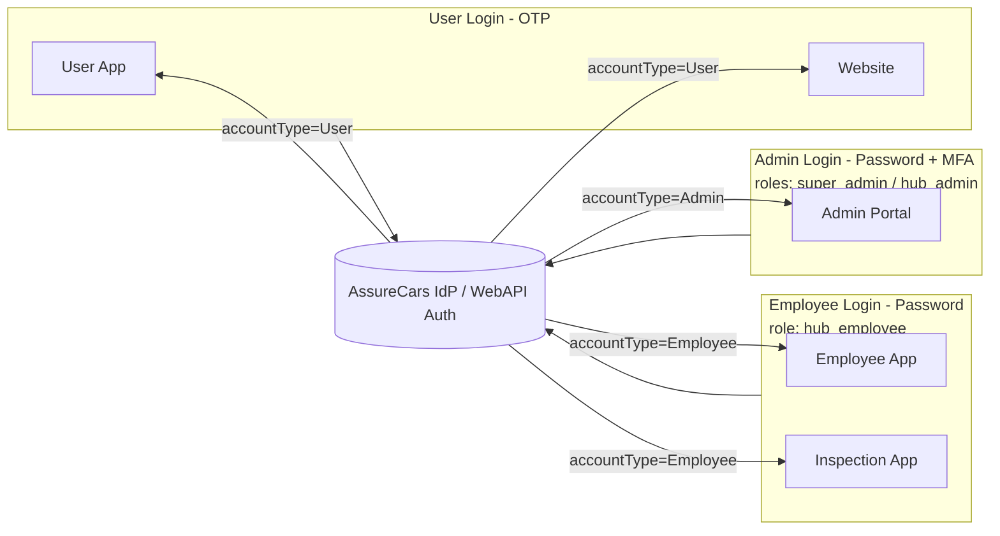

> **Inspection App note:** AssureCars does **not** rebuild the Inspection App. Its **existing login screen** will be updated (by the Inspection App team) to authenticate against the AssureCars IdP using **Hub Employee (Employee Login)** tokens. User Login and Admin (dashboard) tokens are **never** accepted by the Inspection App.

> **Hub scoping:** `hub_admin` and `hub_employee` may read/act only within their assigned hub(s) (`employee_hubs`, many-to-many; `is_primary` marks the home hub). `super_admin` has no hub links and is treated as global. Every hub-owned query (inventory, leads, test drives, reservations, inspections) is filtered by the caller's hub scope.

### 4.2 Personas

| Actor | Login type / Role | Surface | Hub scope | Responsibilities |
|-------|-------------------|---------|-----------|------------------|
| **Guest** | *(none)* | Web, User App | — | Browse & search without login; never sees hub identity |
| **Registered User (buyer/seller)** | **User Login** (`user`) | Web, User App | — | Interest, test drives, reservations, Sell/PDI requests *(purchase/financing: future scope)* |
| **Hub Employee — Sales** | **Employee Login** (`hub_employee`) | Employee App | Assigned hub(s) | Own leads, run test drives, close deals for their hub |
| **Hub Employee — Test-Drive Agent / Driver** | **Employee Login** (`hub_employee`) | Employee App | Assigned hub(s) | Deliver doorstep test drives, capture start/end, OTP verify |
| **Hub Employee — Inspection Technician** | **Employee Login** (`hub_employee`) | **Inspection App (external)** | Assigned hub(s) | Perform inspection & generate PDF in the existing Inspection Mobile App |
| **Hub Admin** | **Admin Login** (`hub_admin`) | Admin Portal | Assigned hub(s) | Onboard hub employees + consignors; manage hub catalog, inventory, slot capacity, leads, reservations |
| **Super Admin** | **Admin Login** (`super_admin`) | Admin Portal | **All hubs** | Onboard hubs, hub admins, hub employees, consignors; RBAC; dealer-wide settings; reassign Sell/PDI |
| **System (schedulers/jobs)** | Service account | Backend | — | Reminders, slot expiry, lead SLA, reconciliation, nearest-hub routing |

> **Job functions vs. role:** Sales, Driver, and Inspection Technician are **designations/permissions within the single `hub_employee` role**, not separate login types. Catalog/pricing, marketing/CMS, and support duties are **permissions granted to `hub_admin`/`super_admin`** on the Admin Portal.

---

## 5. Scope — Applications & Modules

### 5.1 Client Applications

| App | Platform | Framework (Recommended) | Primary Users |
|-----|----------|-------------------------|---------------|
| End-User Mobile App | Android + iOS | **Flutter** (or React Native) | Registered users | **User Login** (OTP) |
| Dealership Employee App | Android + iOS | **Flutter** (or React Native) | Hub Employees (Sales, Drivers, Technicians) | **Employee Login** (`hub_employee`) |
| Customer Website | Web (responsive/SSR) | **Next.js (React)** | Registered users, guests | **User Login** (OTP) for authenticated flows |
| Admin Panel | Web (SPA) | **React + Ant Design / MUI** | Super Admin, Hub Admins | **Admin Login** (password + MFA) |
| WebAPI | Backend | **.NET (ASP.NET Core Web API)** or **Node/NestJS** | All clients | Validates JWT `accountType` + `allowedClients` + hub scope |
| **Inspection Mobile App** *(existing / external)* | Android + iOS | *Pre-built — not rebuilt by AssureCars* | Hub Employees (Inspection Technicians) | **Employee Login** *(existing app login updated to federate with AssureCars IdP)* |

> Cross-platform choice rationale in §8.

> **Integration note — Inspection App:** A **Vehicle Inspection Mobile App already exists** and is the **system of record for inspections**. It performs the checklist and generates a **well-designed PDF inspection report**. AssureCars does **not** rebuild inspection capture — it **integrates** to ingest the PDF (plus structured summary metadata) and attach it to the matching car. **Inspection App login** uses **Employee Login** or **Admin Login** (existing app UI updated to federate with AssureCars IdP — see §4.1, §10.1). The Dealership Employee App has **no** inspection-capture module. Full integration design in **§10.14**.

### 5.2 Functional Modules & Release Phase

Modules are tagged by phase. **MVP is deliberately non-financial.** Everything money-related is deferred.

| # | Module | Phase | Notes |
|---|--------|-------|-------|
| 1 | Identity, Auth & Profile | **MVP** | **Three login types** (User OTP, Employee password, Admin password+MFA) + **hub-scoped role hierarchy** (super_admin / hub_admin / hub_employee / user); client-scoped JWTs; RBAC + hub scoping for staff |
| 2 | Car Catalog & Inventory | **MVP** | Unique-VIN inventory, publish/delist |
| 3 | Search, Filter & Discovery | **MVP** | Faceted search over dealer inventory |
| 4 | Vehicle Detail & Inspection Report | **MVP** | Shows ingested PDF report |
| 5 | **Interest / Lead Management** | **MVP** | Core demand-capture |
| 6 | **Test Drive Booking (concurrent-slot engine)** | **MVP** | Flagship capability |
| 7 | Employee Operations (leads, test-drive execution) | **MVP** | Dealer staff app |
| 8 | **Inspection App Integration** (ingest external PDF) | **MVP** | Trust content |
| 9 | Notifications (Push/SMS/Email/WhatsApp) | **MVP** *(push/email/SMS)* | WhatsApp later |
| 10 | Admin & Configuration (RBAC, hubs, slot capacity) | **MVP** | Dealer self-service config |
| 11 | Reporting & Analytics (basic ops dashboards) | **MVP** *(basic)* | Advanced BI later |
| 12 | Reservation / Deal Handoff (**non-financial**) | **MVP** | Marks car reserved/sold; closed offline |
| 13 | Reviews & Ratings | **Phase 2** | Post test-drive / deal |
| 14 | Inspection Services — **Sell request + PDI request** (user-initiated) | **Phase 2** | Both use existing Inspection App; PDF is the output |
| — | Cross-cutting: Media, Audit, Feature Flags, Localization | **MVP** | Throughout |

Each module's **End-to-End (E2E) workflow** is detailed in §10. **Scope is defined through Phase 2 only (all non-financial).** Online payments, purchase, financing, and refunds are **out of the current scope**; §10.8 retains a brief note purely to show the architecture does not preclude them later.

---

## 6. High-Level Architecture

AssureCars is a **single-tenant, self-hosted deployment per dealer**. Inside one dealer instance it follows a **modular (service-oriented) architecture** behind an API Gateway, delivered as a **modular monolith** (bounded contexts in one deployable) to keep the self-host footprint small; contexts can be extracted to services only if a large dealer needs it.

**MVP-first diagram:** solid nodes = MVP. Dashed/"(future scope)" nodes = **financial** capabilities that are **out of the current scope** (beyond Phase 2), shown only to confirm they are not precluded.

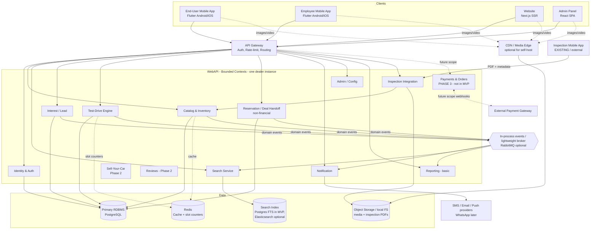

### 6.1 Architectural Principles

- **API-first & single source of truth:** every client uses the same versioned WebAPI. No business logic in clients.
- **Self-host-friendly by default:** MVP must run on a **modest single-server footprint** (Docker Compose) using **PostgreSQL + Redis + local/S3 object storage**, with **Postgres full-text search** so no Elasticsearch is required to start. Heavier components (Elasticsearch, dedicated broker, CDN) are **optional upgrades** for larger dealers.
- **Bounded contexts** with clear ownership; **in-process domain events** in the monolith, upgradeable to a broker (RabbitMQ) when needed.
- **CQRS-lite (optional):** reads can be served from a search index; in MVP the RDBMS + Postgres FTS is sufficient.
- **Idempotency & optimistic concurrency** for all state-changing operations (critical for test-drive & inventory transitions).
- **Eventual consistency** for projections (search, analytics); **strong consistency** for inventory-state transitions. *(No money/consistency concerns in MVP — payments are future scope.)*

---

## 7. Cross-Cutting: The Inventory Uniqueness Principle

A defining constraint of AssureCars (vs. a generic e-commerce catalog): **each vehicle is a single, unique unit (one VIN = quantity 1)** within a dealer's instance.

- Every car carries a **listing source**: `Owned`, `ConsignedVendor`, or `ConsignedIndividual`. Consigned cars link to a **Consignor** record (the owning vendor/individual) that carries the **agreed commission %** captured at onboarding, for operational reference/display — the platform stores the rate but performs **no payout calculation or settlement** (offline).
- A car can transition: `Draft → In-Inspection → Certified → Live → Reserved → Sold`.
- Only **one deal** can ultimately claim a given car. **In the MVP this is a non-financial reservation** — a staff member (or the system on buyer request) marks the car `Reserved`, then the dealer closes the deal offline and marks it `Sold`. **No payment is involved.** (Online purchase with payment is future scope.)
- **Test drives are NOT purchases** → many people can test-drive the same car over time; concurrency here is about *scheduling capacity*, not exclusive ownership (see §10.6).

This distinction drives two different concurrency strategies:

| Operation | Concurrency Rule | Mechanism | Phase |
|-----------|------------------|-----------|-------|
| **Reserve / mark sold** (non-financial) | Exactly one winner per car | Optimistic lock on `Car.row_version` + state machine | **MVP** |
| **Online purchase with payment** | Exactly one winner + money correctness | Optimistic lock + payment/hold TTL + idempotency | **future scope** |
| **Test drive a car** | Many allowed, capped by slot capacity | Atomic capacity counter per (car/hub, slot) with Redis + DB constraint | **MVP** |

---

## 8. Technology Stack

The stack is chosen so an SMB dealer can **self-host on a single modest server**. "MVP core" = required to run; "Optional upgrade" = only for larger dealers/scale.

| Layer | MVP Core (self-host) | Optional Upgrade | Notes |
|-------|----------------------|------------------|-------|
| Mobile (User + Employee) | **Flutter** | React Native | Single codebase → Android + iOS; shared design system |
| Website | **Next.js (React) + TypeScript** | — | SSR/ISR for SEO on the dealer's listings |
| Admin Panel | **React SPA + MUI/Ant Design** | — | Data-dense; role-based views |
| Backend / WebAPI | **ASP.NET Core Web API (C#)** — modular monolith | NestJS/Spring | Background workers for jobs/reminders |
| Reverse proxy / gateway | **NGINX / Caddy** (TLS, routing) | Kong / YARP | Caddy gives automatic HTTPS — great for self-host |
| Primary DB | **PostgreSQL** | Managed Postgres | ACID, JSONB, `row_version`; **also powers search via FTS** in MVP |
| Search | **PostgreSQL Full-Text Search** | Elasticsearch / OpenSearch | Avoids running ES for small catalogs |
| Cache / Locks | **Redis** | Redis cluster | Slot counters, sessions, rate limits |
| Messaging | **In-process events** | RabbitMQ | No external broker needed for MVP |
| Object Storage | **Local filesystem / MinIO** | AWS S3 / Azure Blob + CDN | Car media + inspection PDFs; S3-compatible API keeps code portable |
| Auth | **OIDC + JWT** (Keycloak or built-in) | Auth0/Cognito | **User Login:** OTP · **Employee/Admin Login:** password (+ MFA for Admin); tokens scoped by `accountType` and `allowedClients` |
| Notifications | **Push (FCM/APNs), Email (SMTP/SES/SendGrid), SMS (MSG91/Twilio)** | WhatsApp Business API *(later)* | Dealer supplies provider keys |
| Maps / Geo | **Google Maps / Mapbox** | — | Hub locator, doorstep routing |
| ~~Payments~~ | **— (not in MVP)** | Razorpay/Stripe/PayU *(future scope)* | Deferred financial module |
| Observability | **Structured logs + Sentry** | OpenTelemetry + Prometheus/Grafana | Lightweight for self-host; richer optional |
| Packaging | **Docker + Docker Compose** | Kubernetes (Helm) | Compose = one-command self-host; K8s for large dealers |
| CI/CD | **GitHub Actions** → build & publish images | — | Dealers pull tagged images/updates |

### 8.1 Shared Concerns Across Clients

- **Design system / component library** shared between mobile apps; token-based theming synced to Figma.
- **API SDK** (generated from OpenAPI) for typed client access.
- **Feature flags** (LaunchDarkly / self-hosted) for staged rollout.
- **Localization** (i18n) — start en-IN + Hindi; extensible.

---

## 9. Data Model — Full Database Schema

**Database:** PostgreSQL 15+ (single-tenant per dealer instance). **Naming:** `snake_case` tables/columns; UUID primary keys; `timestamptz` for all timestamps (UTC storage); `row_version` (`bigint`, optimistic concurrency) on hot rows.

**Design principles**

- **Normalized core + JSONB archive:** business entities are relational; the Inspection App's full payload is stored in `inspection_reports.raw_payload` for audit/replay while queryable fields are normalized.
- **Unique VIN inventory:** one sellable car per VIN; enforced with a partial unique index on active statuses.
- **Inspection is external:** AssureCars stores ingested reports + PDF references; it does not own checklist line items.
- **MVP is non-financial:** `reservations` has no payment columns. `orders` / `payments` are future scope (not created in MVP migrations).

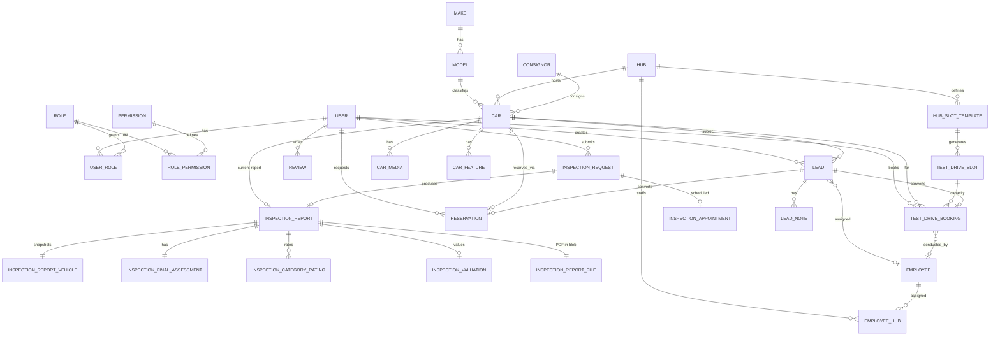

### 9.1 Key Enumerations

| Enum | Values |
|------|--------|
| `account_type` | `User, Employee, Admin` |
| `auth_client` | `UserApp, Website, EmployeeApp, AdminPortal, InspectionApp` |
| `car_status` | `Draft, InInspection, Refurbishing, Certified, Live, Reserved, Sold, Delisted` |
| `listing_source` | `Owned, ConsignedVendor, ConsignedIndividual` |
| `consignor_type` | `Vendor, Individual` |
| `fuel_type` | `Petrol, Diesel, CNG, LPG, Electric, Hybrid, Other` |
| `transmission_type` | `Manual, Automatic, AMT, CVT, DCT, Other` |
| `body_style` | `Hatchback, Sedan, SUV, MUV, Coupe, Convertible, Pickup, Other` |
| `vehicle_category` | `OLD, NEW` *(from Inspection App)* |
| `inspection_context` | `RESALE, SELL, PDI` *(Inspection App → AssureCars: RESALE = inventory certification)* |
| `inspection_report_status` | `Ingested, Pass, Fail, Superseded, Unmatched` |
| `repair_recommendation` | `NO_REPAIR, MINOR_REPAIR, MAJOR_REPAIR, NOT_RECOMMENDED` |
| `inspection_request_type` | `Sell, PDI` |
| `pdi_subtype` | `NewCar, UsedCarOtherDealer` |
| `inspection_request_status` | `Requested, Scheduled, Inspected, ReportReady, Closed, Cancelled` |
| `test_drive_mode` | `AtHub, Doorstep` |
| `test_drive_booking_status` | `Requested, Confirmed, Reminded, EnRoute, CheckedIn, InProgress, Completed, NoShow, Cancelled, Rescheduled` |
| `lead_source` | `Interest, WalkIn, Referral, SellRequest, Other` |
| `lead_status` | `New, Contacted, Qualified, TestDriveScheduled, Negotiation, Won, Lost` |
| `reservation_status` | `Reserved, DealInProgress, Sold, Released, Cancelled` |
| `media_type` | `Photo, Video, Document` |
| `media_purpose` | `Listing, Inspection, TestDrive, Other` |
| `blob_storage_provider` | `Local, MinIO, S3, AzureBlob` |

**Grade derivation (display):** AssureCars maps `inspection_valuations.overall_score` (0–100) to a letter grade for UI badges:

| Score range | Grade |
|-------------|-------|
| 95–100 | A |
| 90–94 | A− |
| 85–89 | B+ |
| 80–84 | B |
| 75–79 | B− |
| 70–74 | C+ |
| &lt; 70 | C or below *(configurable per dealer)* |

**Publish gate:** `inspection_reports.status = Pass` AND `inspection_final_assessments.recommendation IN (NO_REPAIR, MINOR_REPAIR)` AND `cars.list_price IS NOT NULL`.

### 9.2 Inspection App JSON → Database Mapping

The Inspection App emits structured JSON plus a PDF. AssureCars ingests both via §10.14.

**Sample payload (confirmed contract)**

```json
{
  "reportId": "3542dba1-0bce-4135-8b31-4b417c0a5a4a",
  "inspectionId": "2348fa87-acf5-45c9-ba34-dd709e88f5b9",
  "context": "RESALE",
  "vehicle": {
    "vin": "SA",
    "category": "OLD",
    "numberOfOwnerships": null,
    "numberOfKeys": null,
    "year": 2025,
    "manufacturer": null,
    "make": "tata Nexon",
    "model": "Advanture plus",
    "variant": null,
    "trim": null,
    "bodyStyle": null,
    "fuelType": null,
    "transmission": null,
    "color": "white",
    "registrationNumber": "KSK",
    "engineNumber": null,
    "chassisNumber": null,
    "odometerKm": 35000
  },
  "finalAssessment": {
    "categoryRatings": {
      "Exterior": 5,
      "Interior": 4,
      "Engine": 4,
      "Electrical": 4,
      "Tyres": 4,
      "Suspension": 4,
      "Safety": 4,
      "Documentation": 4
    },
    "overallCondition": null,
    "recommendation": "NO_REPAIR",
    "remarks": "good"
  },
  "valuation": {
    "overallScore": 80,
    "conditionBand": "Good",
    "benchmarkScore": 70,
    "deltaVsTypical": 10,
    "marketPosition": "Above typical",
    "verdict": "Good condition — a sound purchase with only minor negotiation room.",
    "priceGuidance": "Condition supports pricing at or slightly above the typical asking price.",
    "damageCount": 0
  }
}
```

> **Note — the confirmed contract is richer than the sample above.** The Inspection App emits the full report graph (see `core/data/report/ReportModels.kt` in the Inspection App and API §12.1): top-level `inspector`, `device`, `gps`, `inspectionTime`, `scores`, `damageSummary`, `integrity`, `overallCondition`, `inspectorNotes`, `finalRecommendation`, `inspectionStatus`, plus arrays `images[]`, `checklist[]`, and `damageAssessment[]`. As of **v1.8** the **complete** graph is normalized into first-class tables (migration `002`), not just archived in `raw_payload`.

**Field mapping — summary (migration 001)**

| Inspection App JSON | Database target | Notes |
|---------------------|-----------------|-------|
| `reportId` | `inspection_reports.external_report_id` | Unique; idempotency key for webhook |
| `inspectionId` | `inspection_reports.external_inspection_id` | Unique |
| `context` | `inspection_reports.context` | `RESALE` → inventory cert; `SELL` / `PDI` when request-driven |
| `inspectedAt` | `inspection_reports.inspected_at` | ISO-8601 |
| `vehicle.*` | `inspection_report_vehicles` | Snapshot at inspection time; **`vehicle.vin` is the inventory correlation key** — not the catalog `cars` row |
| `finalAssessment.categoryRatings` | `inspection_category_ratings` | One row per category |
| `finalAssessment.recommendation` | `inspection_final_assessments.recommendation` | Drives pass/fail gate |
| `finalAssessment.remarks` | `inspection_final_assessments.remarks` | |
| `valuation.*` | `inspection_valuations` | Powers score ring + grade badge in UI |
| *(PDF file)* | `inspection_report_files` | Binary in object storage; metadata in DB |
| *(entire payload)* | `inspection_reports.raw_payload` | JSONB archive (anti-corruption layer) |

**Field mapping — complete data (migration 002, v1.8)**

| Inspection App JSON | Database target | Notes |
|---------------------|-----------------|-------|
| `inspector`, `device`, `gps`, `inspectionTime` | `inspection_report_details` | 1:1 with report; inspector/device/GPS/timing |
| `scores.*` (exterior/interior/safety/cosmetic/confidence) | `inspection_report_details.*_score` | Aggregate scores 0–100 |
| `damageSummary.*` (total + bySeverity) | `inspection_report_details.damage_*_count` | Precomputed severity counts |
| `integrity.*` (missing/duplicate/lowQuality/suspicious/potentialFraud) | `inspection_report_details.integrity_*` | Fraud/quality signals |
| `overallCondition`, `inspectorNotes`, `finalRecommendation`, `inspectionStatus` | `inspection_report_details.*` | Report-level verdicts |
| `checklist[].items[]` | `inspection_checklist_items` | One row per answered item, retains `section_id`/`section_title` |
| `images[]` **and** `checklist[].items[].images[]` | `inspection_report_images` | Every photo/video + metadata; `checklist_item_id` links item photos; binaries in object storage |
| `images[].annotations[]` | `inspection_image_annotations` | Manual damage markups per image |
| `images[].aiFindings[]` | `inspection_image_ai_findings` | AI detections + bounding boxes per image |
| `damageAssessment[]` | `inspection_damage_assessments` | Consolidated AI + manual damage list |

This makes the entire inspection queryable in SQL (e.g. "all cars with a high-severity door-panel finding") without parsing JSON at read time, while `raw_payload` remains the loss-less archive.

**Context routing**

| `context` (Inspection App) | AssureCars consumer | Correlation key |
|-----------------------------|---------------------|-----------------|
| `RESALE` | Inventory certification (`cars`) | `vehicle.vin` or `vehicle.registrationNumber` |
| `SELL` | `inspection_requests` (type=Sell) | `inspectionRequestId` passed at appointment creation |
| `PDI` | `inspection_requests` (type=PDI) | `inspectionRequestId` |

### 9.3 PostgreSQL DDL (Prototype Baseline)

> **Migration strategy:** one forward-only migration per release; enums created as PostgreSQL `ENUM` types (or `TEXT` + `CHECK` if easier to evolve). Below is the **v1 prototype baseline** — implement as `001_initial_schema.sql`.

```sql
-- ============================================================
-- AssureCars — Initial Schema (PostgreSQL 15+)
-- Single-tenant per dealer instance
-- ============================================================

CREATE EXTENSION IF NOT EXISTS "pgcrypto";
CREATE EXTENSION IF NOT EXISTS "citext";

-- -------------------- ENUMS --------------------

CREATE TYPE account_type AS ENUM ('User', 'Employee', 'Admin');
CREATE TYPE auth_client AS ENUM ('UserApp', 'Website', 'EmployeeApp', 'AdminPortal', 'InspectionApp');
CREATE TYPE car_status AS ENUM (
  'Draft', 'InInspection', 'Refurbishing', 'Certified', 'Live', 'Reserved', 'Sold', 'Delisted'
);
CREATE TYPE listing_source AS ENUM ('Owned', 'ConsignedVendor', 'ConsignedIndividual');
CREATE TYPE consignor_type AS ENUM ('Vendor', 'Individual');
CREATE TYPE fuel_type AS ENUM ('Petrol', 'Diesel', 'CNG', 'LPG', 'Electric', 'Hybrid', 'Other');
CREATE TYPE transmission_type AS ENUM ('Manual', 'Automatic', 'AMT', 'CVT', 'DCT', 'Other');
CREATE TYPE body_style AS ENUM (
  'Hatchback', 'Sedan', 'SUV', 'MUV', 'Coupe', 'Convertible', 'Pickup', 'Other'
);
CREATE TYPE vehicle_category AS ENUM ('OLD', 'NEW');
CREATE TYPE inspection_context AS ENUM ('RESALE', 'SELL', 'PDI');
CREATE TYPE inspection_report_status AS ENUM ('Ingested', 'Pass', 'Fail', 'Superseded', 'Unmatched');
CREATE TYPE repair_recommendation AS ENUM ('NO_REPAIR', 'MINOR_REPAIR', 'MAJOR_REPAIR', 'NOT_RECOMMENDED');
CREATE TYPE inspection_request_type AS ENUM ('Sell', 'PDI');
CREATE TYPE pdi_subtype AS ENUM ('NewCar', 'UsedCarOtherDealer');
CREATE TYPE inspection_request_status AS ENUM (
  'Requested', 'Scheduled', 'Inspected', 'ReportReady', 'Closed', 'Cancelled'
);
CREATE TYPE test_drive_mode AS ENUM ('AtHub', 'Doorstep');
CREATE TYPE test_drive_booking_status AS ENUM (
  'Requested', 'Confirmed', 'Reminded', 'EnRoute', 'CheckedIn',
  'InProgress', 'Completed', 'NoShow', 'Cancelled', 'Rescheduled'
);
CREATE TYPE lead_source AS ENUM ('Interest', 'WalkIn', 'Referral', 'SellRequest', 'Other');
CREATE TYPE lead_status AS ENUM (
  'New', 'Contacted', 'Qualified', 'TestDriveScheduled', 'Negotiation', 'Won', 'Lost'
);
CREATE TYPE reservation_status AS ENUM ('Reserved', 'DealInProgress', 'Sold', 'Released', 'Cancelled');
CREATE TYPE media_type AS ENUM ('Photo', 'Video', 'Document');
CREATE TYPE media_purpose AS ENUM ('Listing', 'Inspection', 'TestDrive', 'Other');
CREATE TYPE blob_storage_provider AS ENUM ('Local', 'MinIO', 'S3', 'AzureBlob');

-- -------------------- IDENTITY & RBAC --------------------

CREATE TABLE users (
  id              UUID PRIMARY KEY DEFAULT gen_random_uuid(),
  phone           VARCHAR(20) NOT NULL,
  phone_verified  BOOLEAN NOT NULL DEFAULT FALSE,
  email           CITEXT,
  email_verified  BOOLEAN NOT NULL DEFAULT FALSE,
  full_name       VARCHAR(200),
  account_type    account_type NOT NULL DEFAULT 'User',
  is_active       BOOLEAN NOT NULL DEFAULT TRUE,
  created_at      TIMESTAMPTZ NOT NULL DEFAULT now(),
  updated_at      TIMESTAMPTZ NOT NULL DEFAULT now(),
  CONSTRAINT uq_users_phone UNIQUE (phone)
);

CREATE TABLE roles (
  id          UUID PRIMARY KEY DEFAULT gen_random_uuid(),
  code        VARCHAR(50) NOT NULL UNIQUE,  -- canonical: super_admin, hub_admin, hub_employee (seeded by 004)
  name        VARCHAR(100) NOT NULL,
  description TEXT
);

CREATE TABLE permissions (
  id          UUID PRIMARY KEY DEFAULT gen_random_uuid(),
  code        VARCHAR(100) NOT NULL UNIQUE,
  description TEXT
);

CREATE TABLE user_roles (
  user_id     UUID NOT NULL REFERENCES users(id) ON DELETE CASCADE,
  role_id     UUID NOT NULL REFERENCES roles(id) ON DELETE CASCADE,
  assigned_at TIMESTAMPTZ NOT NULL DEFAULT now(),
  PRIMARY KEY (user_id, role_id)
);

CREATE TABLE role_permissions (
  role_id       UUID NOT NULL REFERENCES roles(id) ON DELETE CASCADE,
  permission_id UUID NOT NULL REFERENCES permissions(id) ON DELETE CASCADE,
  PRIMARY KEY (role_id, permission_id)
);

CREATE TABLE refresh_tokens (
  id              UUID PRIMARY KEY DEFAULT gen_random_uuid(),
  user_id         UUID NOT NULL REFERENCES users(id) ON DELETE CASCADE,
  token_hash      VARCHAR(128) NOT NULL UNIQUE,
  family_id       UUID NOT NULL,
  account_type    account_type NOT NULL,
  client_id       auth_client NOT NULL,
  allowed_clients auth_client[] NOT NULL,
  expires_at      TIMESTAMPTZ NOT NULL,
  revoked_at      TIMESTAMPTZ,
  created_at      TIMESTAMPTZ NOT NULL DEFAULT now()
);

CREATE TABLE staff_credentials (
  user_id               UUID PRIMARY KEY REFERENCES users(id) ON DELETE CASCADE,
  password_hash         VARCHAR(255) NOT NULL,
  must_change_password  BOOLEAN NOT NULL DEFAULT FALSE,
  mfa_secret            VARCHAR(255),
  mfa_enabled           BOOLEAN NOT NULL DEFAULT FALSE,
  failed_attempts       SMALLINT NOT NULL DEFAULT 0,
  locked_until          TIMESTAMPTZ,
  last_login_at         TIMESTAMPTZ,
  updated_at            TIMESTAMPTZ NOT NULL DEFAULT now()
  -- account_type on users must be Employee or Admin (enforced in application layer)
);

CREATE TABLE otp_sessions (
  id           UUID PRIMARY KEY DEFAULT gen_random_uuid(),
  phone        VARCHAR(20) NOT NULL,
  client_id    auth_client NOT NULL,
  otp_hash     VARCHAR(128) NOT NULL,
  attempts     SMALLINT NOT NULL DEFAULT 0,
  expires_at   TIMESTAMPTZ NOT NULL,
  verified_at  TIMESTAMPTZ,
  created_at   TIMESTAMPTZ NOT NULL DEFAULT now()
);
CREATE INDEX idx_otp_sessions_phone ON otp_sessions (phone, expires_at DESC);

-- -------------------- DEALER CONFIG --------------------

CREATE TABLE dealer_settings (
  id                    UUID PRIMARY KEY DEFAULT gen_random_uuid(),
  dealer_name           VARCHAR(200) NOT NULL,
  logo_url              TEXT,
  primary_domain        VARCHAR(255),
  default_city          VARCHAR(100),
  reservation_hold_hours INT NOT NULL DEFAULT 48,
  grade_thresholds      JSONB NOT NULL DEFAULT '{}',  -- configurable A/B/C cutoffs
  notification_config   JSONB NOT NULL DEFAULT '{}',
  created_at            TIMESTAMPTZ NOT NULL DEFAULT now(),
  updated_at            TIMESTAMPTZ NOT NULL DEFAULT now()
);

CREATE TABLE feature_flags (
  id          UUID PRIMARY KEY DEFAULT gen_random_uuid(),
  code        VARCHAR(80) NOT NULL UNIQUE,
  enabled     BOOLEAN NOT NULL DEFAULT FALSE,
  description TEXT,
  updated_at  TIMESTAMPTZ NOT NULL DEFAULT now()
);

-- -------------------- CATALOG REFERENCE --------------------

CREATE TABLE makes (
  id         UUID PRIMARY KEY DEFAULT gen_random_uuid(),
  name       VARCHAR(100) NOT NULL UNIQUE,
  is_active  BOOLEAN NOT NULL DEFAULT TRUE
);

CREATE TABLE models (
  id         UUID PRIMARY KEY DEFAULT gen_random_uuid(),
  make_id    UUID NOT NULL REFERENCES makes(id),
  name       VARCHAR(100) NOT NULL,
  body_style body_style,
  is_active  BOOLEAN NOT NULL DEFAULT TRUE,
  UNIQUE (make_id, name)
);

-- -------------------- HUBS & STAFF --------------------

CREATE TABLE hubs (
  id            UUID PRIMARY KEY DEFAULT gen_random_uuid(),
  code          VARCHAR(50) NOT NULL UNIQUE,
  name          VARCHAR(150) NOT NULL,
  address_line  TEXT,
  city          VARCHAR(100) NOT NULL,
  state         VARCHAR(100),
  pincode       VARCHAR(20),
  latitude      NUMERIC(10, 7),
  longitude     NUMERIC(10, 7),
  phone         VARCHAR(20),
  is_active     BOOLEAN NOT NULL DEFAULT TRUE,
  created_at    TIMESTAMPTZ NOT NULL DEFAULT now()
);

CREATE TABLE employees (
  id              UUID PRIMARY KEY DEFAULT gen_random_uuid(),
  user_id         UUID NOT NULL UNIQUE REFERENCES users(id),
  employee_code   VARCHAR(50) UNIQUE,
  designation     VARCHAR(100),
  is_field_agent  BOOLEAN NOT NULL DEFAULT FALSE,
  is_active       BOOLEAN NOT NULL DEFAULT TRUE,
  created_at      TIMESTAMPTZ NOT NULL DEFAULT now()
);

CREATE TABLE employee_hubs (
  employee_id UUID NOT NULL REFERENCES employees(id) ON DELETE CASCADE,
  hub_id      UUID NOT NULL REFERENCES hubs(id) ON DELETE CASCADE,
  is_primary  BOOLEAN NOT NULL DEFAULT FALSE,
  PRIMARY KEY (employee_id, hub_id)
);

CREATE TABLE hub_slot_templates (
  id                    UUID PRIMARY KEY DEFAULT gen_random_uuid(),
  hub_id                UUID NOT NULL REFERENCES hubs(id) ON DELETE CASCADE,
  name                  VARCHAR(100) NOT NULL DEFAULT 'Default',
  operating_days        SMALLINT[] NOT NULL DEFAULT '{1,2,3,4,5,6}',  -- ISO dow Mon=1
  open_time_local       TIME NOT NULL DEFAULT '09:00',
  close_time_local      TIME NOT NULL DEFAULT '19:00',
  test_drive_duration_min SMALLINT NOT NULL DEFAULT 20,
  buffer_min            SMALLINT NOT NULL DEFAULT 0,
  default_capacity      SMALLINT NOT NULL DEFAULT 3,
  timezone              VARCHAR(64) NOT NULL DEFAULT 'Asia/Kolkata',
  is_active             BOOLEAN NOT NULL DEFAULT TRUE,
  created_at            TIMESTAMPTZ NOT NULL DEFAULT now()
);

-- -------------------- CONSIGNORS --------------------

CREATE TABLE consignors (
  id             UUID PRIMARY KEY DEFAULT gen_random_uuid(),
  -- Each consignor is onboarded for exactly ONE hub (migration 004).
  -- A consigned car must share its consignor's hub (enforced by trigger).
  hub_id         UUID NOT NULL REFERENCES hubs(id),
  type           consignor_type NOT NULL,
  name           VARCHAR(200) NOT NULL,
  phone          VARCHAR(20),
  email          CITEXT,
  company        VARCHAR(200),
  address        TEXT,
  -- Agreed commission rate captured at onboarding (Vendor & Individual).
  -- Reference/display only — NO payout calculation or settlement (offline).
  commission_pct NUMERIC(5,2) CHECK (commission_pct >= 0 AND commission_pct <= 100),
  notes          TEXT,
  created_at     TIMESTAMPTZ NOT NULL DEFAULT now(),
  updated_at     TIMESTAMPTZ NOT NULL DEFAULT now()
);
CREATE INDEX idx_consignors_hub ON consignors (hub_id);

-- -------------------- INVENTORY (CARS) --------------------

CREATE TABLE cars (
  id                      UUID PRIMARY KEY DEFAULT gen_random_uuid(),
  vin                     VARCHAR(40) NOT NULL,
  registration_number     VARCHAR(30),
  model_id                UUID REFERENCES models(id),
  hub_id                  UUID REFERENCES hubs(id),
  listing_source          listing_source NOT NULL DEFAULT 'Owned',
  consignor_id            UUID REFERENCES consignors(id),
  status                  car_status NOT NULL DEFAULT 'Draft',
  year                    SMALLINT,
  odometer_km             INTEGER,
  fuel_type               fuel_type,
  transmission            transmission_type,
  body_style              body_style,
  color                   VARCHAR(60),
  number_of_owners        SMALLINT,
  number_of_keys          SMALLINT,
  engine_number           VARCHAR(60),
  chassis_number          VARCHAR(60),
  list_price_paise        BIGINT,           -- INR stored as paise (₹1 = 100 paise)
  emi_from_paise          BIGINT,
  td_capacity_per_slot    SMALLINT NOT NULL DEFAULT 1,
  current_inspection_report_id UUID,       -- FK added after inspection_reports exists
  certified_at            TIMESTAMPTZ,
  published_at            TIMESTAMPTZ,
  sold_at                 TIMESTAMPTZ,
  row_version             BIGINT NOT NULL DEFAULT 0,
  created_at              TIMESTAMPTZ NOT NULL DEFAULT now(),
  updated_at              TIMESTAMPTZ NOT NULL DEFAULT now(),
  CONSTRAINT chk_consigned_requires_consignor CHECK (
    listing_source = 'Owned' OR consignor_id IS NOT NULL
  )
);

CREATE UNIQUE INDEX uq_cars_vin_active
  ON cars (vin)
  WHERE status NOT IN ('Sold', 'Delisted');

CREATE INDEX idx_cars_status_hub ON cars (status, hub_id);
CREATE INDEX idx_cars_list_price ON cars (list_price_paise) WHERE status = 'Live';

CREATE TABLE car_features (
  id          UUID PRIMARY KEY DEFAULT gen_random_uuid(),
  car_id      UUID NOT NULL REFERENCES cars(id) ON DELETE CASCADE,
  feature     VARCHAR(120) NOT NULL,
  UNIQUE (car_id, feature)
);

CREATE TABLE car_media (
  id              UUID PRIMARY KEY DEFAULT gen_random_uuid(),
  car_id          UUID NOT NULL REFERENCES cars(id) ON DELETE CASCADE,
  media_type      media_type NOT NULL DEFAULT 'Photo',
  purpose         media_purpose NOT NULL DEFAULT 'Listing',
  storage_key     TEXT NOT NULL,
  url             TEXT,
  sort_order      SMALLINT NOT NULL DEFAULT 0,
  is_primary      BOOLEAN NOT NULL DEFAULT FALSE,
  created_at      TIMESTAMPTZ NOT NULL DEFAULT now()
);

-- -------------------- INSPECTION REPORTS (from external app) --------------------

CREATE TABLE inspection_reports (
  id                       UUID PRIMARY KEY DEFAULT gen_random_uuid(),
  external_report_id       UUID NOT NULL UNIQUE,      -- reportId from Inspection App
  external_inspection_id   UUID NOT NULL UNIQUE,      -- inspectionId from Inspection App
  context                  inspection_context NOT NULL,
  car_id                   UUID REFERENCES cars(id),
  inspection_request_id    UUID,                      -- FK added after inspection_requests
  status                   inspection_report_status NOT NULL DEFAULT 'Ingested',
  inspected_at             TIMESTAMPTZ,
  ingested_at              TIMESTAMPTZ NOT NULL DEFAULT now(),
  superseded_by_id         UUID REFERENCES inspection_reports(id),
  raw_payload              JSONB NOT NULL,
  created_at               TIMESTAMPTZ NOT NULL DEFAULT now()
);

CREATE INDEX idx_inspection_reports_car ON inspection_reports (car_id) WHERE car_id IS NOT NULL;
CREATE INDEX idx_inspection_reports_context ON inspection_reports (context, ingested_at DESC);

CREATE TABLE inspection_report_vehicles (
  inspection_report_id   UUID PRIMARY KEY REFERENCES inspection_reports(id) ON DELETE CASCADE,
  vin                    VARCHAR(40),
  registration_number    VARCHAR(30),
  category               vehicle_category,
  year                   SMALLINT,
  manufacturer           VARCHAR(100),
  make                   VARCHAR(100),
  model                  VARCHAR(100),
  variant                VARCHAR(100),
  trim                   VARCHAR(100),
  body_style             body_style,
  fuel_type              fuel_type,
  transmission           transmission_type,
  color                  VARCHAR(60),
  engine_number          VARCHAR(60),
  chassis_number         VARCHAR(60),
  odometer_km            INTEGER,
  number_of_ownerships   SMALLINT,
  number_of_keys         SMALLINT
);

CREATE TABLE inspection_final_assessments (
  inspection_report_id UUID PRIMARY KEY REFERENCES inspection_reports(id) ON DELETE CASCADE,
  overall_condition    VARCHAR(50),
  recommendation       repair_recommendation NOT NULL,
  remarks              TEXT
);

CREATE TABLE inspection_category_ratings (
  id                   UUID PRIMARY KEY DEFAULT gen_random_uuid(),
  inspection_report_id UUID NOT NULL REFERENCES inspection_reports(id) ON DELETE CASCADE,
  category             VARCHAR(50) NOT NULL,   -- Exterior, Interior, Engine, ...
  rating               SMALLINT NOT NULL CHECK (rating BETWEEN 1 AND 5),
  UNIQUE (inspection_report_id, category)
);

CREATE TABLE inspection_valuations (
  inspection_report_id UUID PRIMARY KEY REFERENCES inspection_reports(id) ON DELETE CASCADE,
  overall_score        SMALLINT NOT NULL CHECK (overall_score BETWEEN 0 AND 100),
  condition_band       VARCHAR(30),
  benchmark_score      SMALLINT,
  delta_vs_typical     SMALLINT,
  market_position      VARCHAR(60),
  verdict              TEXT,
  price_guidance       TEXT,
  damage_count         INTEGER NOT NULL DEFAULT 0,
  derived_grade        VARCHAR(5)              -- A, A-, B+, ... computed at ingest
);

CREATE TABLE inspection_report_files (
  id                   UUID PRIMARY KEY DEFAULT gen_random_uuid(),
  inspection_report_id UUID NOT NULL UNIQUE REFERENCES inspection_reports(id) ON DELETE CASCADE,
  storage_provider     blob_storage_provider NOT NULL DEFAULT 'MinIO',
  storage_bucket       VARCHAR(100) NOT NULL,
  storage_key          TEXT NOT NULL,
  file_name            VARCHAR(255) NOT NULL,
  mime_type            VARCHAR(80) NOT NULL DEFAULT 'application/pdf',
  file_size_bytes      BIGINT,
  sha256_hash          CHAR(64),
  created_at           TIMESTAMPTZ NOT NULL DEFAULT now()
);

CREATE TABLE inspection_unmatched_queue (
  id                   UUID PRIMARY KEY DEFAULT gen_random_uuid(),
  inspection_report_id UUID NOT NULL UNIQUE REFERENCES inspection_reports(id) ON DELETE CASCADE,
  reason               TEXT NOT NULL,
  resolved_at          TIMESTAMPTZ,
  resolved_by_user_id  UUID REFERENCES users(id),
  resolved_car_id      UUID REFERENCES cars(id),
  created_at           TIMESTAMPTZ NOT NULL DEFAULT now()
);

-- -------------------- INSPECTION REQUESTS (Sell / PDI — Phase 2) --------------------

CREATE TABLE inspection_requests (
  id                       UUID PRIMARY KEY DEFAULT gen_random_uuid(),
  request_number           VARCHAR(30) NOT NULL UNIQUE,
  user_id                  UUID NOT NULL REFERENCES users(id),
  type                     inspection_request_type NOT NULL,
  pdi_subtype              pdi_subtype,
  status                   inspection_request_status NOT NULL DEFAULT 'Requested',
  -- intake snapshot (before a Car row exists)
  make                     VARCHAR(100),
  model                    VARCHAR(100),
  variant                  VARCHAR(100),
  registration_number      VARCHAR(30),
  vin                      VARCHAR(40),
  location_text            TEXT,
  city                     VARCHAR(100),
  -- Customer geo + nearest-hub routing (migration 004).
  pincode                  VARCHAR(20),
  customer_latitude        NUMERIC(10, 7),
  customer_longitude       NUMERIC(10, 7),
  assigned_hub_id          UUID REFERENCES hubs(id),   -- nearest active hub that owns this request
  inspection_report_id     UUID REFERENCES inspection_reports(id),
  resulting_car_id         UUID REFERENCES cars(id),
  external_inspection_id   UUID,
  notes                    TEXT,
  created_at               TIMESTAMPTZ NOT NULL DEFAULT now(),
  updated_at               TIMESTAMPTZ NOT NULL DEFAULT now(),
  CONSTRAINT chk_pdi_subtype CHECK (
    type <> 'PDI' OR pdi_subtype IS NOT NULL
  )
);
CREATE INDEX idx_inspection_requests_assigned_hub ON inspection_requests (assigned_hub_id, status);

ALTER TABLE inspection_reports
  ADD CONSTRAINT fk_inspection_reports_request
  FOREIGN KEY (inspection_request_id) REFERENCES inspection_requests(id);

CREATE TABLE inspection_appointments (
  id                    UUID PRIMARY KEY DEFAULT gen_random_uuid(),
  inspection_request_id UUID NOT NULL UNIQUE REFERENCES inspection_requests(id) ON DELETE CASCADE,
  hub_id                UUID REFERENCES hubs(id),
  scheduled_start       TIMESTAMPTZ NOT NULL,
  scheduled_end         TIMESTAMPTZ NOT NULL,
  address_text          TEXT,
  status                VARCHAR(30) NOT NULL DEFAULT 'Scheduled',
  created_at            TIMESTAMPTZ NOT NULL DEFAULT now()
);

-- Link car → current report
ALTER TABLE cars
  ADD CONSTRAINT fk_cars_current_inspection
  FOREIGN KEY (current_inspection_report_id) REFERENCES inspection_reports(id);

-- -------------------- LEADS & CRM --------------------

CREATE TABLE leads (
  id                    UUID PRIMARY KEY DEFAULT gen_random_uuid(),
  user_id               UUID NOT NULL REFERENCES users(id),
  car_id                UUID NOT NULL REFERENCES cars(id),
  source                lead_source NOT NULL DEFAULT 'Interest',
  status                lead_status NOT NULL DEFAULT 'New',
  score                 SMALLINT NOT NULL DEFAULT 0,
  assigned_employee_id  UUID REFERENCES employees(id),
  sla_due_at            TIMESTAMPTZ,
  closed_at             TIMESTAMPTZ,
  row_version           BIGINT NOT NULL DEFAULT 0,
  created_at            TIMESTAMPTZ NOT NULL DEFAULT now(),
  updated_at            TIMESTAMPTZ NOT NULL DEFAULT now()
);

CREATE INDEX idx_leads_assigned_status ON leads (assigned_employee_id, status);
CREATE UNIQUE INDEX uq_leads_open_per_user_car
  ON leads (user_id, car_id)
  WHERE status NOT IN ('Won', 'Lost');

CREATE TABLE lead_notes (
  id              UUID PRIMARY KEY DEFAULT gen_random_uuid(),
  lead_id         UUID NOT NULL REFERENCES leads(id) ON DELETE CASCADE,
  author_user_id  UUID REFERENCES users(id),
  note            TEXT NOT NULL,
  disposition     VARCHAR(50),
  created_at      TIMESTAMPTZ NOT NULL DEFAULT now()
);

-- -------------------- TEST DRIVE ENGINE --------------------

CREATE TABLE test_drive_slots (
  id              UUID PRIMARY KEY DEFAULT gen_random_uuid(),
  hub_id          UUID NOT NULL REFERENCES hubs(id),
  car_id          UUID REFERENCES cars(id),
  template_id     UUID REFERENCES hub_slot_templates(id),
  mode            test_drive_mode NOT NULL DEFAULT 'AtHub',
  start_utc       TIMESTAMPTZ NOT NULL,
  end_utc         TIMESTAMPTZ NOT NULL,
  capacity        SMALLINT NOT NULL CHECK (capacity > 0),
  booked_count    SMALLINT NOT NULL DEFAULT 0 CHECK (booked_count >= 0),
  is_active       BOOLEAN NOT NULL DEFAULT TRUE,
  CONSTRAINT chk_slot_capacity CHECK (booked_count <= capacity),
  UNIQUE (hub_id, car_id, mode, start_utc)
);

CREATE INDEX idx_td_slots_availability
  ON test_drive_slots (car_id, start_utc)
  WHERE is_active AND booked_count < capacity;

CREATE TABLE test_drive_bookings (
  id                  UUID PRIMARY KEY DEFAULT gen_random_uuid(),
  booking_number      VARCHAR(30) NOT NULL UNIQUE,
  slot_id             UUID NOT NULL REFERENCES test_drive_slots(id),
  car_id              UUID NOT NULL REFERENCES cars(id),
  user_id             UUID NOT NULL REFERENCES users(id),
  lead_id             UUID REFERENCES leads(id),
  employee_id         UUID REFERENCES employees(id),
  mode                test_drive_mode NOT NULL,
  status              test_drive_booking_status NOT NULL DEFAULT 'Requested',
  doorstep_address    TEXT,
  otp_hash            VARCHAR(128),
  idempotency_key     VARCHAR(64) UNIQUE,
  feedback_rating     SMALLINT CHECK (feedback_rating BETWEEN 1 AND 5),
  feedback_text       TEXT,
  row_version         BIGINT NOT NULL DEFAULT 0,
  created_at          TIMESTAMPTZ NOT NULL DEFAULT now(),
  updated_at          TIMESTAMPTZ NOT NULL DEFAULT now(),
  UNIQUE (slot_id, user_id)
);

-- -------------------- RESERVATIONS (non-financial MVP) --------------------

CREATE TABLE reservations (
  id                  UUID PRIMARY KEY DEFAULT gen_random_uuid(),
  reservation_number  VARCHAR(30) NOT NULL UNIQUE,
  car_id              UUID NOT NULL REFERENCES cars(id),
  user_id             UUID NOT NULL REFERENCES users(id),
  lead_id             UUID REFERENCES leads(id),
  status              reservation_status NOT NULL DEFAULT 'Reserved',
  hold_expires_at     TIMESTAMPTZ NOT NULL,
  reserved_by_user_id UUID REFERENCES users(id),
  closed_by_user_id   UUID REFERENCES users(id),
  notes               TEXT,
  idempotency_key     VARCHAR(64) UNIQUE,
  row_version         BIGINT NOT NULL DEFAULT 0,
  reserved_at         TIMESTAMPTZ NOT NULL DEFAULT now(),
  closed_at           TIMESTAMPTZ
);

CREATE UNIQUE INDEX uq_reservations_active_car
  ON reservations (car_id)
  WHERE status IN ('Reserved', 'DealInProgress');

-- -------------------- REVIEWS (Phase 2) --------------------

CREATE TABLE reviews (
  id                  UUID PRIMARY KEY DEFAULT gen_random_uuid(),
  user_id             UUID NOT NULL REFERENCES users(id),
  car_id              UUID REFERENCES cars(id),
  test_drive_booking_id UUID REFERENCES test_drive_bookings(id),
  rating_overall      SMALLINT NOT NULL CHECK (rating_overall BETWEEN 1 AND 5),
  rating_condition    SMALLINT CHECK (rating_condition BETWEEN 1 AND 5),
  rating_staff        SMALLINT CHECK (rating_staff BETWEEN 1 AND 5),
  comment             TEXT,
  is_verified         BOOLEAN NOT NULL DEFAULT TRUE,
  is_visible          BOOLEAN NOT NULL DEFAULT TRUE,
  created_at          TIMESTAMPTZ NOT NULL DEFAULT now()
);

-- -------------------- NOTIFICATIONS & AUDIT --------------------

CREATE TABLE notification_deliveries (
  id              UUID PRIMARY KEY DEFAULT gen_random_uuid(),
  user_id         UUID REFERENCES users(id),
  channel         VARCHAR(20) NOT NULL,   -- push, sms, email
  template_code   VARCHAR(80) NOT NULL,
  payload         JSONB NOT NULL DEFAULT '{}',
  status          VARCHAR(20) NOT NULL DEFAULT 'Pending',
  sent_at         TIMESTAMPTZ,
  created_at      TIMESTAMPTZ NOT NULL DEFAULT now()
);

CREATE TABLE audit_logs (
  id              UUID PRIMARY KEY DEFAULT gen_random_uuid(),
  actor_user_id   UUID REFERENCES users(id),
  entity_type     VARCHAR(60) NOT NULL,
  entity_id       UUID NOT NULL,
  action          VARCHAR(60) NOT NULL,
  before_state    JSONB,
  after_state     JSONB,
  ip_address      INET,
  created_at      TIMESTAMPTZ NOT NULL DEFAULT now()
);

CREATE INDEX idx_audit_entity ON audit_logs (entity_type, entity_id, created_at DESC);

-- -------------------- CMS (MVP lightweight) --------------------

CREATE TABLE cms_banners (
  id              UUID PRIMARY KEY DEFAULT gen_random_uuid(),
  title           VARCHAR(200) NOT NULL,
  subtitle        TEXT,
  image_url       TEXT,
  link_url        TEXT,
  sort_order      SMALLINT NOT NULL DEFAULT 0,
  is_active       BOOLEAN NOT NULL DEFAULT TRUE,
  valid_from      TIMESTAMPTZ,
  valid_to        TIMESTAMPTZ,
  created_at      TIMESTAMPTZ NOT NULL DEFAULT now()
);

-- -------------------- IDEMPOTENCY --------------------

CREATE TABLE idempotency_keys (
  key             VARCHAR(64) PRIMARY KEY,
  request_hash    VARCHAR(64) NOT NULL,
  response_status SMALLINT,
  response_body   JSONB,
  created_at      TIMESTAMPTZ NOT NULL DEFAULT now(),
  expires_at      TIMESTAMPTZ NOT NULL
);
```

### 9.3.1 Complete Inspection Data (migration `002_inspection_complete_data.sql`)

The v1 baseline (§9.3) normalizes only the inspection **summary**. Migration `002` persists the **complete** inspection graph so nothing is trapped in `raw_payload`. Implement as `database/migrations/002_inspection_complete_data.sql` (forward-only, runs after `001`).

| Table | Cardinality | Captures |
|-------|-------------|----------|
| `inspection_report_details` | 1:1 with `inspection_reports` | inspector, device, GPS, timing, aggregate scores, damage summary counts, integrity signals, report-level verdicts |
| `inspection_checklist_items` | many per report | full checklist responses (status / rating / numeric / text / damage types), grouped by section |
| `inspection_report_images` | many per report | every photo/video: section, position, checklist linkage, capture state, storage keys/URLs, dimensions, quality, hash |
| `inspection_image_annotations` | many per image | manual damage markups (shape, geometry, type, severity, comment) |
| `inspection_image_ai_findings` | many per image | AI detections (type, confidence, severity, bounding box, review flag) |
| `inspection_damage_assessments` | many per report | consolidated AI + manual damage list rendered in the report |

**Design choices**

- App-originated vocabularies (`capture_state`, `quality`, damage `type`/`severity`/`source`, checklist `status`) are stored as `TEXT`, not PG `ENUM`, so the anti-corruption layer absorbs new values without a schema migration.
- Image **binaries** live in object storage (same private-bucket policy as the PDF); `inspection_report_images` records the `storage_key` / `url` / `sha256_hash` metadata.
- `002` also adds `idx_inspection_report_vehicles_vin` and the `link_inspection_reports_by_vin(car_id, vin)` helper that powers the VIN auto-map flow (§10.2, §10.14).

### 9.4 Key Indexes & Constraints Summary

| Rule | Implementation |
|------|----------------|
| One active car per VIN | `uq_cars_vin_active` partial unique index |
| One open lead per user+car | `uq_leads_open_per_user_car` partial unique index |
| One active reservation per car | `uq_reservations_active_car` partial unique index |
| Slot overbooking prevention | `CHECK (booked_count <= capacity)` + conditional `UPDATE` in service layer |
| Inspection webhook idempotency | `UNIQUE (external_report_id)` on `inspection_reports` |
| PDF one-to-one with report | `UNIQUE (inspection_report_id)` on `inspection_report_files` |
| Consigned cars need consignor | `chk_consigned_requires_consignor` on `cars` |
| Inspection ↔ VIN lookup | `idx_inspection_report_vehicles_vin` on `inspection_report_vehicles(vin)` (002) |
| One checklist item row per report+item | `UNIQUE (inspection_report_id, item_id)` on `inspection_checklist_items` (002) |
| One image row per report+image | `UNIQUE (inspection_report_id, external_image_id)` on `inspection_report_images` (002) |

### 9.5 Entity Relationship Notes

- **`cars.current_inspection_report_id`** points to the latest **passing** report used for certification badge and publish gate. Older reports remain in `inspection_reports` with `status = Superseded`.
- **`inspection_report_vehicles`** is a **point-in-time snapshot** from the Inspection App. Catalog fields on `cars` may be enriched from this snapshot during onboarding but are independently editable by admins.
- **`inspection_valuations.overall_score`** drives the prototype's score ring (e.g., 80/100) and **`derived_grade`** (e.g., B) for list cards.
- **`inspection_category_ratings`** powers the summary rows in car detail (Engine, Tyres, etc.) without parsing JSON at read time.
- **Complete data (v1.8):** `inspection_report_details` (1:1), `inspection_checklist_items`, `inspection_report_images` → `inspection_image_annotations` / `inspection_image_ai_findings`, and `inspection_damage_assessments` hang off `inspection_reports` via `ON DELETE CASCADE`, so a report and its full graph are stored and removed atomically.
- **VIN is the inventory correlation key.** `inspection_report_vehicles.vin` maps every inspection to a car; matching is **case-insensitive** and works in both directions — report-arrives-first (parked Unmatched, linked when the car is created) and car-exists-first (linked at ingest). `cars.current_inspection_report_id` is (re)pointed to the latest linked report by `link_inspection_reports_by_vin()`.
- **Sell/PDI flow:** `inspection_requests` is created first; appointment scheduled; Inspection App receives `inspectionRequestId`; on ingest, report links back and optionally creates `cars` row (Sell acceptance).

---

## 10. Module Design & End-to-End Workflows

Each module below documents: **purpose, actors, key APIs, E2E workflow (sequence/flow diagram), states, and edge cases.**

### 10.1 Module: Identity, Auth & Profile

**Purpose:** Three login types with client-scoped JWTs; **hub-scoped role hierarchy**; staff onboarding; profile management; RBAC for employees/admins.

#### 10.1.1 Login Types & Roles Summary

| Login | Endpoint prefix | Method | Roles | Clients in JWT `allowedClients` |
|-------|-----------------|--------|-------|-----------------------------------|
| **User Login** | `/v1/auth/user/*` | OTP | `user` | `UserApp`, `Website` |
| **Employee Login** | `/v1/auth/employee/*` | Password (+ optional MFA) | `hub_employee` | `EmployeeApp`, `InspectionApp` |
| **Admin Login** | `/v1/auth/admin/*` | Password + MFA (required) | `super_admin`, `hub_admin` | `AdminPortal` |

**Role → scope & onboarding authority**

| Role | Hub scope | Can create | Can onboard consignors |
|------|-----------|------------|------------------------|
| `super_admin` | All hubs (global; one seeded/static login) | Hubs, Hub Admins, Hub Employees | Yes (any hub) |
| `hub_admin` | Assigned hub(s) | Hub Employees (for their hub[s]) | Yes (their hub[s]) |
| `hub_employee` | Assigned hub(s) | — | No |
| `user` | — | — | No |

**JWT claims (all login types)**

```json
{
  "sub": "user-uuid",
  "accountType": "User | Employee | Admin",
  "allowedClients": ["UserApp", "Website"],
  "roles": ["hub_admin"],
  "hubIds": ["hub-uuid-1", "hub-uuid-2"],
  "permissions": ["cars:read", "consignors:create"],
  "clientId": "AdminPortal",
  "exp": 1720700000
}
```

The gateway validates that the calling app's `X-Client-Id` header is included in `allowedClients`. Beyond client scoping, the service layer enforces **hub scoping**: for `hub_admin`/`hub_employee` every hub-owned resource is filtered by the token's `hubIds` (empty/absent `hubIds` on a `super_admin` = global). Admin tokens additionally satisfy Admin API permission checks.

**Staff onboarding APIs**

| Method | Endpoint | Who | Description |
|--------|----------|-----|-------------|
| POST | `/v1/admin/hubs` | `super_admin` | Onboard a hub (yard) |
| POST | `/v1/admin/staff` | `super_admin` (any role/hub), `hub_admin` (`hub_employee` on their hub[s]) | Create a staff login; assign role + hub(s) |
| PATCH | `/v1/admin/staff/{id}` | `super_admin`, `hub_admin` (own hub staff) | Update role/hub assignment / deactivate |
| GET | `/v1/admin/staff?hubId=&role=` | `super_admin`, `hub_admin` (own hub[s]) | List staff, hub-scoped |

**Key APIs**

| Method | Endpoint | Login type | Description |
|--------|----------|------------|-------------|
| POST | `/v1/auth/user/otp/request` | User | Send OTP for User App / Website |
| POST | `/v1/auth/user/otp/verify` | User | Verify OTP → User-scoped tokens |
| POST | `/v1/auth/employee/login` | Employee | Password login (`hub_employee`) → Employee + Inspection App tokens |
| POST | `/v1/auth/employee/mfa/verify` | Employee | Complete MFA step if enabled |
| POST | `/v1/auth/admin/login` | Admin | Password login (`super_admin`/`hub_admin`) → MFA challenge |
| POST | `/v1/auth/admin/mfa/verify` | Admin | Verify MFA → Admin Portal token (hub-scoped) |
| POST | `/v1/auth/refresh` | All | Rotate access token (same `allowedClients`) |
| POST | `/v1/auth/logout` | All | Revoke refresh token |
| GET/PUT | `/v1/me` | All | Get/update profile |
| POST | `/v1/me/kyc` | User | Submit KYC *(future scope)* |

**E2E Workflow — User Login (OTP)**

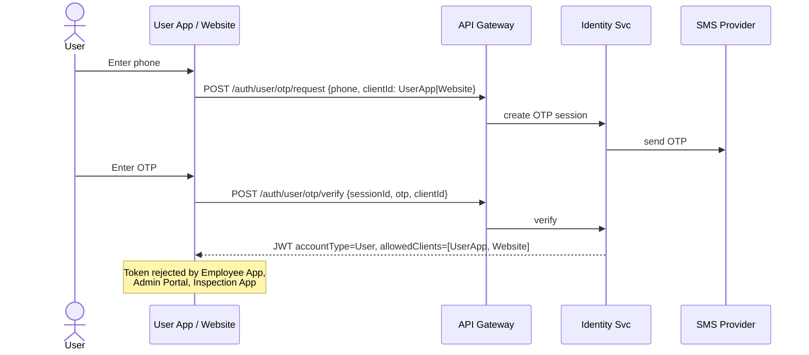

**E2E Workflow — Employee Login**

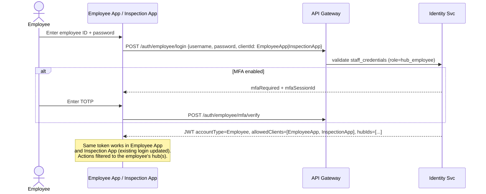

**E2E Workflow — Admin Login (Super Admin / Hub Admin)**

```mermaid
sequenceDiagram
    actor A as Admin
    participant ADM as Admin Portal
    participant GW as API Gateway
    participant ID as Identity Svc

    A->>ADM: Enter admin username + password
    ADM->>GW: POST /auth/admin/login {username, password, clientId: AdminPortal}
    ID-->>ADM: mfaRequired (always for Admin)
    A->>ADM: Enter TOTP
    ADM->>GW: POST /auth/admin/mfa/verify
    ID-->>ADM: JWT accountType=Admin, allowedClients=[AdminPortal], roles=[super_admin|hub_admin], hubIds=[...]
    Note over ADM: Admin token is DASHBOARD-ONLY (no Employee/Inspection App).<br/>super_admin = all hubs; hub_admin = assigned hubs only.
```

**States/Rules**

- Access token 15 min; refresh token rotated on use; refresh reuse detection → revoke family.
- **User Login tokens cannot call** `/v1/employee/*` or `/v1/admin/*` — gateway returns `403`.
- **Employee Login tokens cannot call** `/v1/admin/*` — gateway returns `403`.
- **Admin Login** is a superset: can call Admin + Employee APIs; Inspection App accepts Admin tokens.
- Rate limits on User OTP (3/min, 10/hour/number); lockout + captcha on staff password abuse.
- Inspection App webhook ingestion uses **HMAC service auth**, not user/employee JWT.
- **No KYC in MVP** for User Login.

---

### 10.2 Module: Car Catalog & Inventory

**Purpose:** Manage the lifecycle of each unique car from acquisition to delisting; publish "Live" cars to buyers. Supports **three listing sources** with the same buyer-facing experience.

**Actors:** Hub Admin *(their hub[s])*, Super Admin *(all hubs)*, Hub Employee — Inspection Technician *(inspects via external Inspection App)*, System (indexing).

> **Who manages the catalog:** listings are created/edited on the **Admin Portal** by a **Hub Admin** (scoped to their hub[s]) or the **Super Admin** (all hubs). **Hub Employees do not edit the catalog** — the Employee App is for sales, test-drive, and inspection operations. Every car is assigned to a hub (`cars.hub_id`), and all hub-owned inventory queries are filtered by the caller's hub scope.

#### Listing Sources

| Source (`listing_source`) | Meaning | Consignor captured? | Inspection PDF | Commission % |
|---------------------------|---------|---------------------|----------------|--------------|
| **Owned** | Dealer's own pre-owned stock | No | **Mandatory** | N/A |
| **ConsignedVendor** | Another vendor's car sold on commission | Yes — `Consignor.type = Vendor` | **Mandatory** | **Rate captured on Consignor** (payout/settlement offline) |
| **ConsignedIndividual** | An individual owner's car sold on commission | Yes — `Consignor.type = Individual` | **Mandatory** | **Rate captured on Consignor** (payout/settlement offline) |

- Source is a **required attribute** at car creation. For consigned sources, a **Consignor** (name + contact, optionally company/address, **and the agreed commission %**) is linked for the dealer's operational reference.
- **Inspection Report PDF is mandatory for ALL three sources** — the publish gate (below) rejects any car without an ingested, passing report, with no exception for consigned cars.
- To buyers, all three render identically as listings — source **and commission %** are **internal-only** (visible to dealer staff/admin, never to buyers).
- **Buyers never see the internal hub identity** (hub id/name/code). Public listings show only **city/area** and **distance** (derived from the hub's geo); the exact hub address is revealed only **after** a test-drive booking or reservation is confirmed. The hub is used internally to decide **which hub's employees own the activity**.
- The **unique-VIN, sell-once** rule and reservation concurrency apply **regardless of source**.
- The app records the consignor's **agreed commission %** but performs **no payout calculation, balance tracking, or settlement** — that remains the dealer's offline process.

#### Consignor Onboarding

Before (or while) listing a consigned car, an Admin onboards the **Consignor** — the vendor or individual who owns the car. Consignors are onboarded **for a specific hub** by a **Hub Admin** (their own hub) or the **Super Admin** (any hub). This is where the **agreed commission %** is captured. A consignor is created once and can be reused across multiple consigned cars **within that hub**.

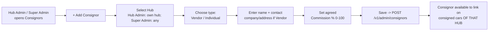

- Each consignor is **bound to exactly one hub** (`consignors.hub_id`, required). A consigned car **must be assigned to the same hub as its consignor** (enforced by DB trigger `trg_car_consignor_same_hub`).
- **Both types** (`Vendor` and `Individual`) capture a `commission_pct` (0–100). It is **optional at the schema level** (a consignor may be onboarded before terms are agreed) but the Admin UI **prompts for it at onboarding**.
- The rate is **reference/display data only** — surfaced to staff on the consignor and consigned-car screens. There is **no payout math, ledger, or settlement**.
- Editing a consignor's `commission_pct` later applies going forward for display; historical deals are closed offline.
- **Authorization:** a Hub Admin sees/manages only their hub's consignors; the Super Admin sees all.

**E2E Workflow — Onboard a Consigned Vehicle**

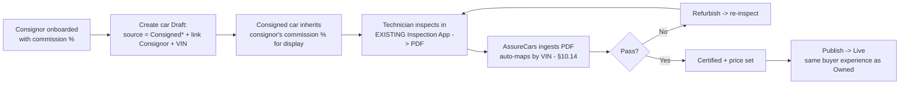

> The commission % rides along the consignor for the dealer's reference; it never affects the buyer-facing listing, pricing display, or the publish gate.

**Car Lifecycle State Machine**

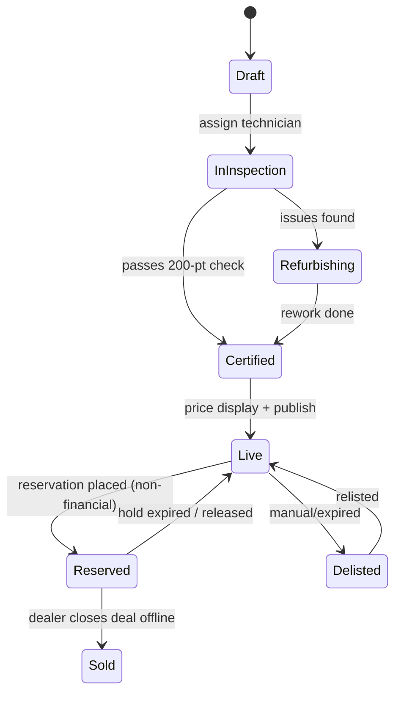

> MVP has no `BookingInProgress`/`Delivered` (payment) states — those arrive with the future scope financial module.

**E2E Workflow — Onboard a Car to Live Listing**

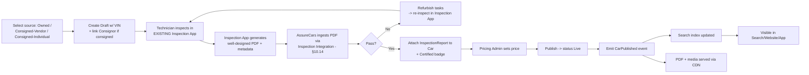

> Inspection is performed in the **existing Inspection Mobile App**, not in AssureCars. AssureCars consumes the resulting **PDF report + complete structured data** through the integration described in **§10.14**, then links it to the car as the `INSPECTION_REPORT`.

#### VIN-Based Inspection Auto-Mapping

The admin never manually stitches an inspection to a car. **VIN is the single correlation key.** When an admin **lists a car by entering its VIN** (create or VIN edit), the Catalog service immediately reconciles any inspection reports already ingested for that VIN — regardless of whether the report or the car arrived first.

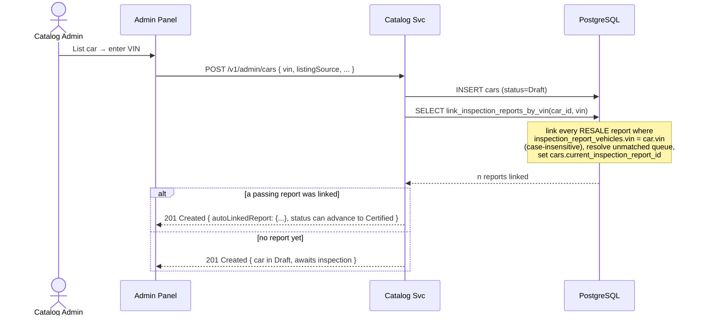

- **Report arrives first (common):** technician inspects before the car is listed → report is parked in `inspection_unmatched_queue`. The instant the admin lists that VIN, the report auto-links and leaves the queue.
- **Car exists first:** the car is listed (Draft), then the inspection is ingested → the ingestion path (§10.14) matches by VIN at ingest time.
- Matching is **case-insensitive** on VIN and scoped to `context = RESALE`. Sell/PDI reports correlate by `inspectionRequestId` instead.
- Re-listing/VIN correction re-runs the same reconciliation; superseded reports keep their history.

**Key APIs**

| Method | Endpoint | Description |
|--------|----------|-------------|
| GET | `/v1/admin/cars?hubId=&status=&listingSource=&q=` | List/search inventory, **hub-scoped** (Hub Admin auto-limited to own hub[s]; Super Admin may pass any `hubId`) |
| POST | `/v1/admin/cars` | Create draft car (requires `vin`, `listingSource`, `hubId`; `consignorId` if consigned — its hub must equal `hubId`). **Auto-maps any inspection report(s) already ingested for that VIN** |
| PATCH | `/v1/admin/cars/{id}` | Update attributes/pricing/source. Changing `vin` re-runs VIN auto-mapping |
| POST | `/v1/admin/cars/{id}/publish` | Move to Live (validates report + price) |
| GET | `/v1/cars/{id}` | Public detail (Live only) — **no hub identity**, only city/area + distance |
| GET | `/v1/cars/{id}/inspection-report` | Certified inspection report |
| GET/POST | `/v1/admin/consignors` | List/create consignors (vendor/individual) incl. `commissionPct` |
| PATCH | `/v1/admin/consignors/{id}` | Update consignor details incl. `commissionPct` |

**Edge cases:** VIN uniqueness enforced; **VIN is mandatory at creation** (it is the inspection correlation key); **consigned sources require a linked consignor**; **publishing is blocked for ANY source without an ingested, passing inspection report** (+ price); listing a VIN auto-links pending inspection reports (see above); concurrent edits use `row_version`. **Commission `commissionPct` (0–100) is captured on the consignor as reference data; payout calculation/settlement remain out of scope.**

---

### 10.3 Module: Search, Filter & Recommendations

**Purpose:** Fast, faceted, geo-aware discovery of Live cars.

**E2E Workflow — Search & Browse**

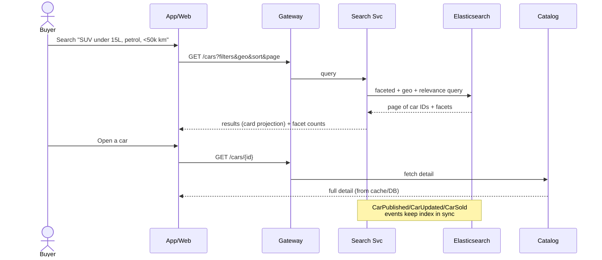

**Facets (buyer):** make, model, year, price, body type, fuel, transmission, km, owners, color, **city/area** (derived from the car's hub — **never the hub id/name**), features.
**Internal filter (staff/admin only):** `hub` (yard), `listing_source` (Owned / Consigned-Vendor / Consigned-Individual) and consignor — **not exposed to buyers**. Staff results are hub-scoped by role.
**Sort:** relevance, price, newest, low-km, distance (computed from the hub's geo without revealing which hub).
**Recommendations:** "similar cars", "recently viewed", "price-drop", personalized via events (Phase 2 ML).
**Consistency:** Sold/Reserved cars removed from index within seconds via events; detail API is source of truth to prevent stale purchase attempts.

---

### 10.4 Module: Interest / Lead Management ("Send Interest")

**Purpose:** Capture buyer intent on a car, create a **Lead**, route it to a Sales Executive, and drive it down the funnel.

**Actors:** Buyer, Sales Executive, Hub Manager, System (scoring, SLA, assignment).

**E2E Workflow — Send Interest → Lead → Assignment → Contact**

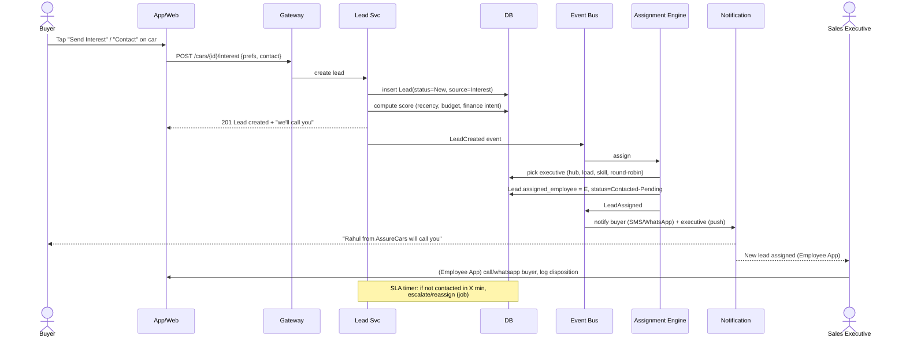

**Lead State Machine**

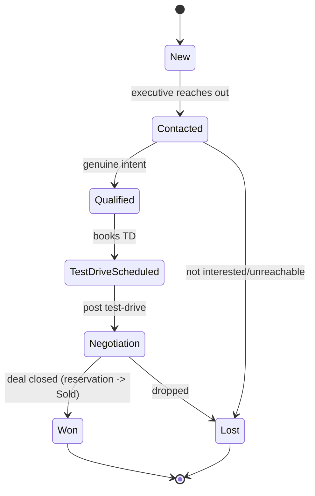

**Key APIs**

| Method | Endpoint | Description |
|--------|----------|-------------|
| POST | `/v1/cars/{id}/interest` | Buyer expresses interest → creates lead |
| GET | `/v1/employee/leads` | Executive's assigned leads (filter/sort by score, SLA) |
| PATCH | `/v1/employee/leads/{id}` | Update status/disposition/next action |
| POST | `/v1/employee/leads/{id}/notes` | Log call/interaction |

**Rules & edge cases**

- Duplicate interest on same car by same user → merge into existing open lead (no duplicate).
- **Lead scoring** prioritizes executive worklist; finance-intent + test-drive-scheduled boost score.
- **SLA & auto-escalation** via scheduled job; unattended leads reassigned.
- Interest is allowed on `Reserved` cars but flagged (waitlist) — buyer notified if the car frees up.

---

### 10.5 Module: Test Drive Booking — Concurrent-Slot Engine (Flagship)

**Purpose:** Let buyers book a test drive at a **scheduled date & time**, either **at a hub** or **doorstep**. Because a test drive is **short** (e.g., 20–30 min) relative to a display slot, the system must allow **multiple test drives for the same time slot**, capped by a **configurable capacity** per car/hub/slot.

> **Hub ownership & buyer privacy:** a test drive always belongs to the **hub that holds the car** (`cars.hub_id`), and **that hub's Hub Employees** manage it (booking, reminders, conducting the drive, OTP verify) — hub-scoped so other hubs' staff don't see it. The **buyer never sees the hub id/name**; they choose a car and a time and (for AtHub) see only **city/area + distance** until the booking is confirmed, at which point the **exact hub address** is revealed.

#### 10.5.1 The Concurrency Problem & Solution

A naive design books "one car = one slot = one booking", which wastes capacity: a car sitting at a hub can be shown to several prospects in overlapping/back-to-back short drives, and doorstep fleets have multiple drivers.

**AssureCars models a slot as a *capacity bucket*, not a binary lock.**

Capacity for a slot is derived from the *minimum* of the constraining resources:

```
effective_capacity(slot) = min(
    car_availability,          // usually 1 physical car, but "back-to-back" short drives => N micro-slots
    hub_bay_capacity,          // parallel test-drive bays / staff at the hub
    available_agents(slot)     // for doorstep: number of free driver-agents in the zone
)
```

Two supported strategies (configurable per hub/car):

1. **Micro-slot subdivision:** a 60-min display window with a 20-min test-drive duration → `capacity = 3` back-to-back drives on the *same* car.
2. **Parallel capacity:** multiple bays/agents allow `capacity = K` genuinely concurrent drives (e.g., doorstep fleet, or a model with multiple demo units).

Either way, the engine exposes a single field: `slot.capacity` and `slot.booked_count`, and **allows booking while `booked_count < capacity`.**

#### 10.5.2 Slot Generation

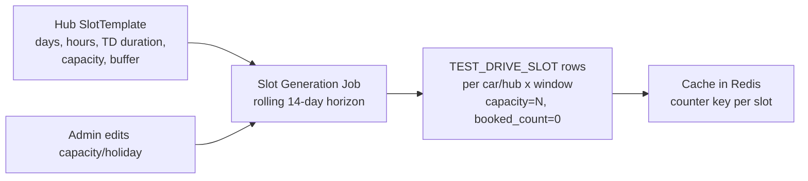

- `SlotTemplate` per hub: operating days/hours, test-drive duration, buffer between drives, default capacity, blackout dates.
- A **rolling generation job** materializes concrete `TEST_DRIVE_SLOT` rows (e.g., 14 days ahead) per available car (at-hub) or per zone (doorstep).
- Each slot has `capacity` and `booked_count`; a Redis counter mirrors it for fast atomic checks.

#### 10.5.3 E2E Workflow — Book a Test Drive (with concurrency-safe capacity)

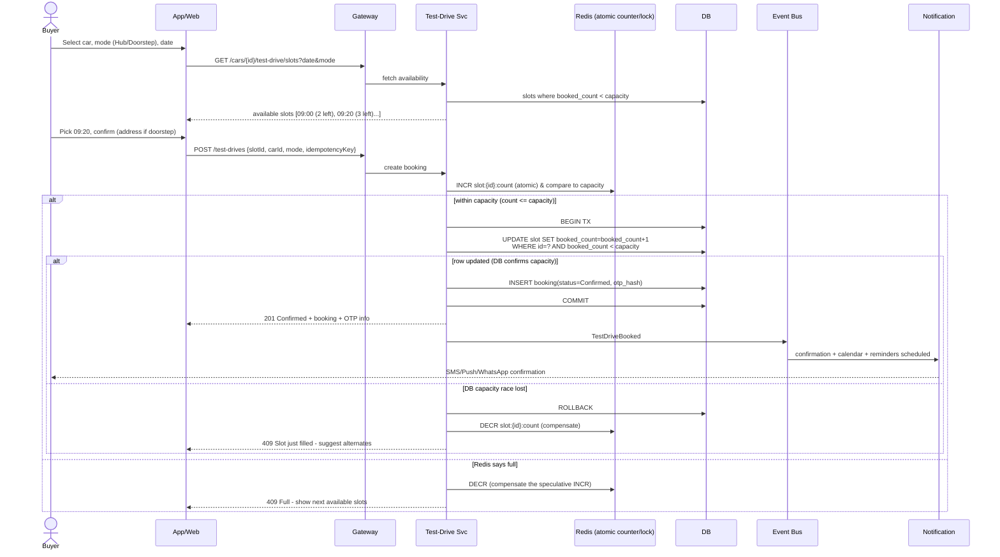

**Why two-layer (Redis + DB conditional update)?**

- **Redis atomic counter** = fast first gate, absorbs thundering-herd on popular slots without hitting the DB.
- **DB conditional `UPDATE ... WHERE booked_count < capacity`** = the authoritative guarantee (Redis can drift/restart). The DB is the source of truth; Redis is optimization + rehydratable from DB.
- **Idempotency key** ensures retries (flaky mobile networks) don't double-book.
- A **unique constraint** `(slot_id, user_id)` prevents the same user booking the same slot twice.

**Concurrency guarantees**

| Scenario | Handling |
|----------|----------|
| 100 users hit the last seat of a slot | Only `capacity` succeed; rest get `409` + alternates |
| Redis down | Fall back to DB conditional update (still correct, slightly slower) |
| Client retries same request | Idempotency key returns the same booking |
| Slot capacity reduced by admin after bookings | New bookings blocked; existing honored or support-managed |

#### 10.5.4 Test Drive Lifecycle

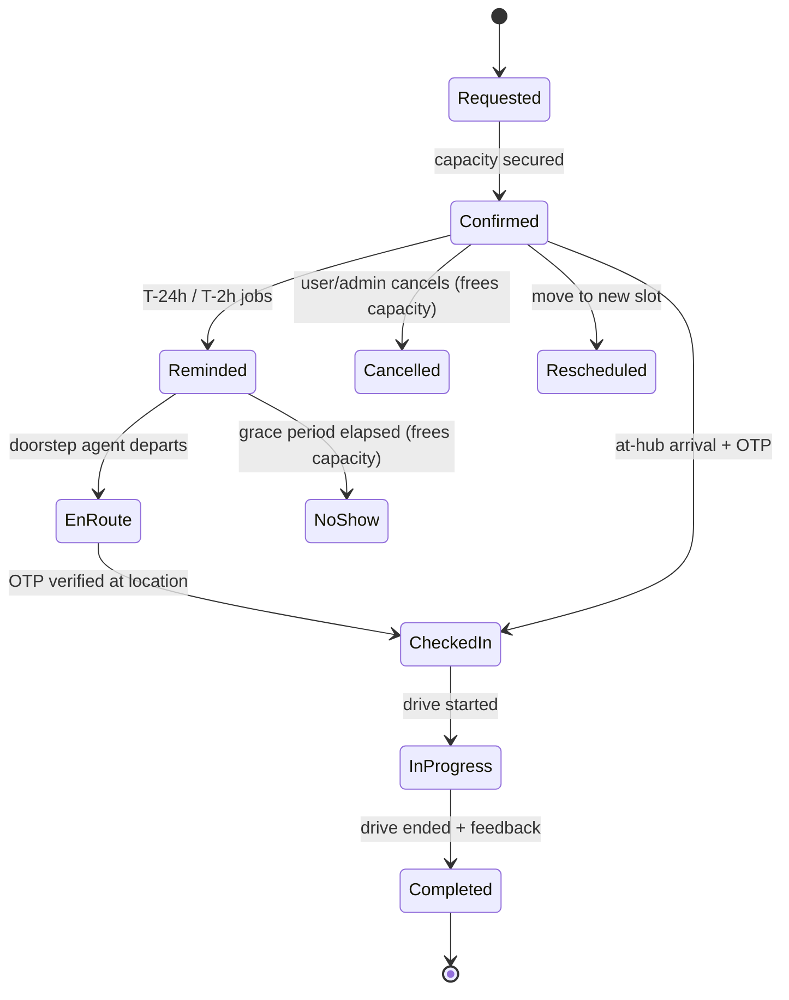

**Key APIs**

| Method | Endpoint | Description |
|--------|----------|-------------|
| GET | `/v1/cars/{id}/test-drive/slots?date&mode` | Available slots (capacity-aware) |
| POST | `/v1/test-drives` | Book (idempotent, capacity-checked) |
| GET | `/v1/test-drives/{id}` | Booking details + OTP status |
| POST | `/v1/test-drives/{id}/cancel` | Cancel → decrements `booked_count`, frees capacity |
| POST | `/v1/test-drives/{id}/reschedule` | Atomic move: free old slot, take new slot |

**Capacity release rules**

- Cancel / NoShow / Reschedule → `booked_count--` (DB + Redis) so the freed seat is immediately bookable.
- A **reconciliation job** periodically recomputes `booked_count` from actual bookings to correct any Redis drift.

---

### 10.6 Module: Employee Operations (Dealership Employee App)

**Purpose:** Field & hub operations — lead handling, **conducting test drives**, inventory updates. *(Vehicle inspection is handled by the separate existing Inspection App — see §10.14 — and is out of scope for this app.)*

**Sub-flows**

**(a) Conduct Test Drive (Doorstep) — E2E**

```mermaid
sequenceDiagram
    actor E as Test-Drive Agent
    participant EA as Employee App
    participant GW as Gateway
    participant TD as Test-Drive Svc
    actor U as Buyer
    participant N as Notification

    Note over EA: Agent sees today's assigned drives (capacity-packed)
    E->>EA: Start route to buyer (status=EnRoute)
    EA->>GW: PATCH /test-drives/{id} status=EnRoute
    GW->>TD: update + live ETA share
    TD->>N: notify buyer with live tracking link
    E->>U: Arrive, request OTP
    U->>E: shares OTP (sent at confirmation)
    E->>EA: enter OTP
    EA->>GW: POST /test-drives/{id}/checkin {otp}
    GW->>TD: verify otp_hash -> status=CheckedIn
    E->>EA: Start drive (odometer/photo) status=InProgress
    E->>EA: End drive + capture feedback/interest
    EA->>GW: POST /test-drives/{id}/complete {feedback}
    TD->>TD: status=Completed; frees agent for next slot
    TD->>N: post-drive nudge -> "Reserve this car / talk to us?"
```

**(b) Inventory & availability** — hub manager toggles car test-drive availability, adjusts slot capacity, marks car in maintenance (auto-suspends future slots).

> **Note:** Inspection capture is **not** part of the Employee App. Technicians use the **existing Inspection Mobile App**, which produces the PDF report ingested via §10.14.

**Key APIs (employee-scoped, RBAC)**

| Method | Endpoint | Description |
|--------|----------|-------------|
| GET | `/v1/employee/schedule` | Agent's test-drive schedule for the day |
| POST | `/v1/test-drives/{id}/checkin` | OTP check-in |
| POST | `/v1/test-drives/{id}/complete` | Complete + feedback |
| POST | `/v1/media/presign` | Get pre-signed upload URL (test-drive photos, odometer) |

**Offline support:** Employee app caches schedule & lead worklist; queues actions (check-in, complete, notes) and syncs when connectivity returns (important for field agents).

---

### 10.7 Module: Reservation / Deal Handoff — **Non-Financial (MVP)**

**Purpose:** Let a buyer/staff **reserve a specific car** so it's held for an offline deal, then let the dealer **close the deal offline** and mark it `Sold`. **No online payment, deposit, or financing in the MVP** — the platform captures intent and hands off to the dealer's existing sales process.

**E2E Workflow — Reserve → Dealer Closes Offline → Sold (no money movement)**

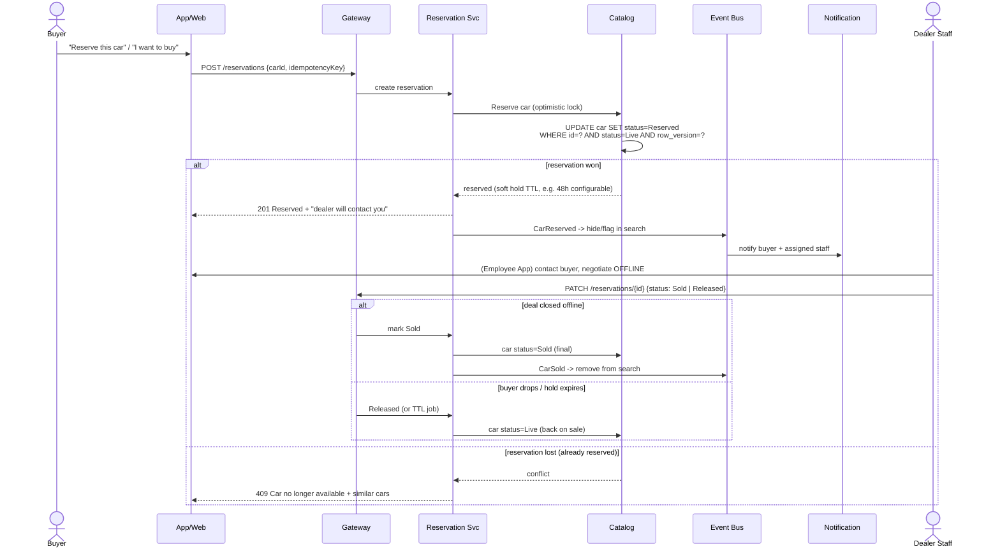

**Single-winner concurrency (still required — the car is unique)**

- Reservation uses **optimistic concurrency**: `UPDATE car SET status=Reserved WHERE status=Live AND row_version=@v`. Only one request wins; others get `409`.
- **Soft hold TTL** (dealer-configurable, e.g. 24–72h) auto-releases stale reservations back to `Live` via a job.
- **Idempotency key** prevents duplicate reservations on retry.
- **No payment, no ledger, no refund** — closing and any money handling happen **outside the system** in the MVP.

**Key APIs (MVP)**

| Method | Endpoint | Description |
|--------|----------|-------------|
| POST | `/v1/reservations` | Reserve a car (optimistic-locked, idempotent) |
| GET | `/v1/reservations/{id}` | Reservation status |
| PATCH | `/v1/reservations/{id}` | Staff: mark `Sold` / `Released` / add notes |
| GET | `/v1/employee/reservations` | Staff worklist of active reservations |

> **future scope upgrade path:** when the financial modules ship, a `Reservation` can spawn an `Order` with online token/payment, financing, and KYC — the reservation state machine already models the hold, so payments slot in without reworking inventory concurrency.

---

### 10.8 Module: Payments, Financing & Refunds — **OUT OF SCOPE (Future Consideration)**

> **Not a committed requirement.** All financial workflows are **out of the current scope** (requirements are defined through Phase 2 only). This short note exists solely to confirm the architecture and data model **do not preclude** adding money workflows later — no design here is a deliverable.

Should the dealer choose to add this in the future, it would cover online deposit/payment, EMI/financing + KYC, gateway integration, ledger, refunds, and invoicing — and would reuse the existing `Reservation` hold as the pre-payment state, so inventory concurrency would not need reworking.

---

### 10.9 Module: Inspection Services — Sell Request & PDI Request — **Phase 2**

**Purpose:** Handle **user-initiated inspection requests** submitted from the **End-User App and Website**. Two request types, both fulfilled by the **existing Inspection App** and both producing the **mandatory PDF report** (ingested via §10.14):

1. **Sell Request** — the user wants to **sell their car to the dealer** (feeds the inventory/acquisition pipeline).
2. **PDI Request** (Pre-Delivery Inspection) — the user wants a car they intend to buy **elsewhere** inspected: a **new car** (from a showroom) or a **used car from another dealer**. The report is a **deliverable to the user**; the car does **not** enter the dealer's inventory.

Both reuse the **slot/appointment** engine (§10.5 infrastructure) to schedule the inspection and the **Inspection Integration** (§10.14) to ingest the resulting PDF.

#### Nearest-hub routing

Every Sell/PDI request is **routed to the customer's nearest active hub**, which then **owns the entire activity** (scheduling, inspection, offer/handoff). The owning hub's **Hub Employees** manage it; the **Hub Admin** oversees it; the **Super Admin** can reassign.

- The customer's location is captured as **GPS latitude/longitude** (preferred) or a **pincode that is geocoded** (fallback) — stored on `inspection_requests` (`customer_latitude`, `customer_longitude`, `pincode`).
- The router picks the **nearest `is_active` hub** by distance to each hub's `latitude/longitude` and sets `assigned_hub_id`.
- **No hub in range / geo missing:** the request is created with `assigned_hub_id = NULL` and parked for **manual assignment** by the Super Admin.
- The **buyer never sees the hub identity** — they only see status and, once scheduled, the appointment address/time.

**Shared intake → routing → scheduling → inspection → report**

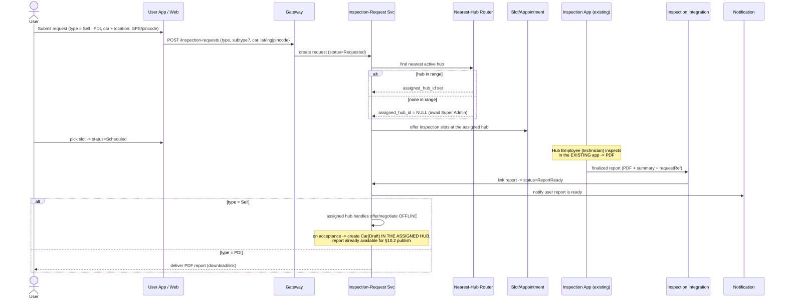

**Sell Request specifics**

```mermaid
flowchart LR
    A[User submits Sell request<br/>App/Web] --> B[Indicative quote<br/>dealer pricing rules]
    B --> C[Schedule inspection<br/>slot engine]
    C --> D[Inspection in EXISTING app -> PDF]
    D --> E[Revised final offer]
    E --> F{Owner accepts?}
    F -- Yes --> G[Paperwork + RC transfer<br/>payout handled offline]
    G --> H[Car enters inventory as Draft<br/>PDF already ingested -> ready to publish]
    F -- No --> I[Lost - nurture]
```

**PDI Request specifics**

- User provides the target car details (make/model, reg no., location, and whether **new** or **used-from-another-dealer**).
- Inspection is scheduled and performed in the existing app; the **PDF is delivered to the user** as the service output.
- The inspected car is **third-party** — it is **not** created as inventory and has **no** listing/sourcing side effects.
- *(Any service fee for PDI is handled offline in early phases; online charging aligns with the future scope financial module.)*

**Key APIs**

| Method | Endpoint | Description |
|--------|----------|-------------|
| POST | `/v1/inspection-requests` | Submit a Sell or PDI request (include `lat`/`lng` or `pincode`); server sets `assignedHubId` via nearest-hub routing |
| GET | `/v1/inspection-requests/{id}` | Track status + report link when ready (no hub identity exposed) |
| GET | `/v1/me/inspection-requests` | User's requests |
| PATCH | `/v1/employee/inspection-requests/{id}` | **Assigned hub's** staff: schedule / close / add notes (hub-scoped) |
| PATCH | `/v1/admin/inspection-requests/{id}/assign` | **Super Admin:** (re)assign the hub when auto-routing had no hub in range or a change is needed |

- On **Sell** acceptance, a `Car` is created in `Draft` **in the assigned hub** with the already-ingested report → flows into §10.2 onboarding (publish gate is satisfied).
- Staff access is **hub-scoped**: only the assigned hub's employees/admin (and the Super Admin) can act on a request.

---

### 10.10 Module: Notifications

**Purpose:** Multi-channel, event-driven messaging. **MVP channels: Push, Email, SMS.** WhatsApp is a later add-on.

- **Event-driven:** subscribes to domain events (`LeadAssigned`, `TestDriveBooked`, `CarReserved`, `CarSold`, reminders).
- **Template + channel routing** with user preferences & quiet hours.
- **Scheduled reminders:** test-drive T-24h/T-2h, reservation hold-expiry warnings, price drops on wishlisted cars.
- **Delivery tracking** + retries + fallback (push → SMS if undelivered).

```mermaid
flowchart LR
    BUS{{Event Bus}} --> NS[Notification Svc]
    NS --> T[Resolve template + locale + prefs]
    T --> R{Channel}
    R --> P[Push FCM/APNs]
    R --> S[SMS]
    R --> E[Email]
    R -. later .-> W[WhatsApp]
    P & S & E & W --> D[Delivery receipts -> retry/fallback]
```

---

### 10.11 Module: Reviews & Ratings — **Phase 2**

**Purpose:** Post-deal and post-test-drive feedback; builds trust and improves ops.

- Verified reviews (only after a completed test drive / closed deal).
- Ratings on car condition accuracy, staff, overall experience.
- Aggregates feed into hub/staff performance dashboards.
- Moderation workflow in Admin (flag, hide, respond).

---

### 10.12 Module: Admin & Configuration

**Purpose:** Let the **dealer self-manage their instance** — catalog, pricing display, inventory, hubs, **slot capacity config**, users/RBAC, content, reservations, and dealer-level settings (branding, providers). The Admin Portal is used by two roles: **Super Admin** (global) and **Hub Admin** (scoped to assigned hub[s]).

**Capabilities** (scope column: **SA** = Super Admin only; **HA** = Hub Admin, within their hub[s]; SA can do everything HA can, across all hubs)

| Area | Functions | Scope | Phase |
|------|-----------|-------|-------|
| Catalog & Pricing display | CRUD cars, bulk import, display price, publish/delist, **set listing source** | HA (own hub), SA (all) | MVP |
| Consignors | Manage vendor/individual consignor records **incl. agreed commission %**, **scoped to a hub**; link to consigned cars *(payout/settlement offline)* | HA (own hub), SA (all) | MVP |
| Hubs (yards) | **Onboard/edit hubs**, geo, blackout dates | **SA only** | MVP |
| Inventory & Bays | Bays, blackout dates | HA (own hub), SA (all) | MVP |
| **Test-Drive Config** | Slot templates, **capacity per slot**, duration, buffer, doorstep zones | HA (own hub), SA (all) | MVP |
| Reservations | View/close/release reservations (non-financial) | HA (own hub), SA (all) | MVP |
| Users & RBAC | Staff onboarding, step-up MFA; **SA creates Hub Admins + Hub Employees & assigns hubs; HA creates Hub Employees for own hub(s)** | SA + HA (see note) | MVP |
| Leads & CRM | Assignment rules, SLA thresholds, escalation | HA (own hub), SA (all) | MVP |
| Sell/PDI requests | Triage assigned-hub requests; **SA (re)assigns hub** when none in range | HA (own hub), SA (all + reassign) | Phase 2 |
| Dealer Settings | Branding/logo, domain, notification providers/keys, localization | **SA only** | MVP |
| Content/CMS | Banners, landing pages, SEO metadata | **SA only** | MVP |
| Promotions/Coupons | Discounts, campaigns | SA only | Phase 2 |
| Payments/Refunds admin | Transactions, refunds, invoices, ledger | — | future scope |
| Feature Flags | Toggle newly shipped modules per release | **SA only** | MVP |

**E2E Workflow — Configure Test-Drive Capacity**

```mermaid
flowchart LR
    A[Admin opens Hub -> Slot Template] --> B[Set duration=20m, capacity=3,<br/>buffer=0, hours 9-19]
    B --> C[Save -> emits SlotTemplateUpdated]
    C --> D[Slot generation job re-materializes<br/>future slots with new capacity]
    D --> E[New capacity live for bookings]
```

---

### 10.13 Module: Reporting & Analytics

**Purpose:** Funnel and operational insights for the dealer. **MVP = basic dashboards from the primary DB;** advanced BI/DWH is a later upgrade. *(No financial/revenue reports in MVP — no money data exists yet.)*

- **MVP:** lightweight dashboards read from the primary DB — interest→TD→reservation funnel, slot fill rate, staff conversion, hub utilization, inventory aging.
- **MVP:** near-real-time ops board for hub managers (today's drives, no-shows, capacity, active reservations).
- **Later:** stream events to a **DWH** for advanced BI; add revenue/financial reporting once the future scope payments module exists.

---

### 10.14 Module: Inspection App Integration (External System)

**Purpose:** Ingest the **well-designed PDF inspection report** *and the complete structured inspection data* produced by the **existing Inspection Mobile App**, persist both, and route them to the right consumer by **VIN** (inventory) or request reference (Sell/PDI). A single integration serves **three consumers**:

1. **Inventory certification** — attach to a `Car`; **mandatory for all sourcing** and gates publishing to Live (§10.2).
2. **Sell request** — attach to the `INSPECTION_REQUEST`; supports the acquisition offer and pre-fills the report when the car is later created.
3. **PDI request** — attach to the `INSPECTION_REQUEST`; delivered to the user as the service output (no inventory car).

**Key facts / assumptions**

- The **Inspection App is the system of record** for the inspection process, checklist, media capture, and PDF rendering. AssureCars does **not** re-implement any of this.
- **Correlation:** for inventory cars, by **VIN** (primary) and/or external inspection id; for **Sell/PDI**, by a **request reference** (`inspectionRequestId`) passed to the app when the appointment is created, since those cars may have no inventory record (PDI) or no `Car` yet (Sell before acceptance).
- Exact contract depends on the Inspection App's capabilities; three ingestion modes are supported (choose per what the app can emit).

#### 10.14.1 Ingestion Modes

| Mode | How | When to use |
|------|-----|-------------|
| **A. Push (webhook)** — *preferred* | Inspection App calls `POST /v1/integrations/inspection/reports` with signed payload + PDF (or PDF URL) when a report is finalized | App can call outbound APIs |
| **B. Pull (polling/API)** | AssureCars polls / calls the Inspection App's API for finalized reports on a schedule | App exposes a read API but no webhooks |
| **C. Manual upload (fallback)** | Admin uploads the PDF + keys metadata in Admin Panel | Bootstrapping / no integration yet |

#### 10.14.2 E2E Workflow — Inspection PDF Ingestion (Push mode)

```mermaid
sequenceDiagram
    actor T as Technician
    participant INS as Inspection App (existing)
    participant GW as AssureCars Gateway
    participant II as Inspection Integration Svc
    participant BLOB as Object Storage
    participant CAT as Catalog Svc
    participant BUS as Event Bus

    T->>INS: Complete inspection -> finalize report
    INS->>INS: Render well-designed PDF + summary
    INS->>GW: POST /integrations/inspection/reports<br/>{context, vin|inspectionRequestId, extId, score, pdf|pdfUrl, summary} + HMAC
    GW->>II: verify signature + idempotency (extId)
    II->>II: route by context (Inventory | Sell | PDI)
    alt Inventory - match car by VIN / external ref
        II->>BLOB: store PDF (private bucket)
        II->>CAT: upsert InspectionReport(car_id, pdf_url, score, grade, status)
        II->>BUS: InspectionReportIngested event
        BUS->>CAT: car eligible for Certified (if pass)
        II-->>INS: 200 {reportId}
    else Sell / PDI - match by inspectionRequestId
        II->>BLOB: store PDF (private bucket)
        II->>II: link report to INSPECTION_REQUEST -> status=ReportReady
        II-->>INS: 200 {reportId}
    else no match
        II->>II: park in "unmatched" queue for admin resolution
        II-->>INS: 202 Accepted (pending match)
    end
```

#### 10.14.3 Integration API (AssureCars side)

| Method | Endpoint | Description |
|--------|----------|-------------|
| POST | `/v1/integrations/inspection/reports` | Receive a finalized report (webhook). HMAC-signed, idempotent on `reportId` |
| POST | `/v1/integrations/inspection/reports/{id}/pdf` | Binary PDF upload (multipart) when not sent as URL |
| GET | `/v1/cars/{id}/inspection-report` | Buyer-facing: summary + pre-signed PDF URL |
| GET | `/v1/cars/{id}/inspection-report/pdf` | Redirect / stream PDF via short-lived pre-signed URL |
| POST | `/v1/admin/inspection/unmatched/{id}/resolve` | Admin links an unmatched report to a car or request |

**Webhook payload (confirmed — Inspection App contract)**

The Inspection App sends the **complete structured JSON + PDF** (either inline multipart or a follow-up upload / `pdfUrl`). Beyond the summary blocks, the body carries the full inspection graph — `inspector`, `device`, `gps`, `inspectionTime`, `scores`, `damageSummary`, `integrity`, `overallCondition`, `inspectorNotes`, `finalRecommendation`, `inspectionStatus`, and the arrays `images[]`, `checklist[]`, `damageAssessment[]` (full field list in API §12.1). Top-level shape:

```json
{
  "reportId": "3542dba1-0bce-4135-8b31-4b417c0a5a4a",
  "inspectionId": "2348fa87-acf5-45c9-ba34-dd709e88f5b9",
  "context": "RESALE",
  "inspectionRequestId": null,
  "inspectedAt": "2026-07-11T14:30:00Z",
  "vehicle": { "vin": "…", "...": "see §9.2" },
  "inspector": { "id": "…", "displayName": "…" },
  "device": { "model": "…", "osVersion": "…", "appVersion": "…" },
  "scores": { "exterior": 90, "interior": 85, "safety": 88, "cosmetic": 82, "confidence": 95 },
  "damageSummary": { "totalDamageCount": 0, "bySeverity": { "low": 0, "medium": 0, "high": 0, "critical": 0 } },
  "integrity": { "missingImages": [], "duplicateImages": [], "lowQualityImages": [], "suspiciousImages": [], "potentialFraud": false },
  "checklist": [ { "sectionId": "exterior", "title": "Exterior", "items": [ { "itemId": "front_bumper", "label": "Front Bumper", "status": "OK", "images": [] } ] } ],
  "images": [ { "imageId": "img-1", "section": "EXTERIOR", "position": "front", "annotations": [], "aiFindings": [] } ],
  "damageAssessment": [],
  "finalAssessment": { "...": "see §9.2" },
  "valuation": { "...": "see §9.2" },
  "pdfUrl": "https://inspection-app.example/reports/3542dba1....pdf"
}
```

| Field | Required | Description |
|-------|----------|-------------|
| `reportId` | Yes | UUID; **idempotency key** → `inspection_reports.external_report_id` |
| `inspectionId` | Yes | UUID → `inspection_reports.external_inspection_id` |
| `context` | Yes | `RESALE` (inventory cert), `SELL`, or `PDI` |
| `inspectionRequestId` | When Sell/PDI | AssureCars request UUID for correlation |
| `inspectedAt` | Recommended | ISO-8601 timestamp |
| `vehicle` | Yes | Vehicle snapshot (see §9.2) |
| `finalAssessment` | Yes | Category ratings + recommendation |
| `valuation` | Yes | Score, condition band, verdict |
| `pdfUrl` | One of pdfUrl/file | URL to fetch PDF, or send file via multipart / follow-up endpoint |

**Ingestion service pseudocode**

```
ON POST /integrations/inspection/reports:
  1. VERIFY HMAC signature
  2. IF reportId exists → return 200 existing report (idempotent)
  3. INSERT inspection_reports (status=Ingested, raw_payload=full body)
  4. INSERT summary tables: inspection_report_vehicles, inspection_final_assessments,
     inspection_category_ratings, inspection_valuations
  4b. INSERT complete-data tables (migration 002):
     - inspection_report_details  (inspector, device, gps, timing, scores,
                                    damageSummary, integrity, verdicts)
     - inspection_checklist_items (one row per checklist[].items[])
     - inspection_report_images   (images[] + checklist[].items[].images[];
                                    store binaries in object storage)
       → inspection_image_annotations, inspection_image_ai_findings
     - inspection_damage_assessments (damageAssessment[])
  5. COMPUTE derived_grade from valuation.overallScore (§9.1)
  6. SET status = Pass|Fail based on recommendation + dealer thresholds
  7. FETCH/STORE PDF → inspection_report_files + object storage
  8. ROUTE by context:
     - RESALE → match car by vehicle.vin (case-insensitive; registrationNumber fallback)
       → set inspection_reports.car_id, cars.current_inspection_report_id,
         cars.status=Certified if Pass
     - SELL/PDI → match inspection_requests by inspectionRequestId
       → set request.status=ReportReady
  9. IF no RESALE car matches the VIN yet → status=Unmatched,
     insert inspection_unmatched_queue (auto-links later when the car is
     listed with that VIN — see §10.2 / link_inspection_reports_by_vin())
  10. EMIT InspectionReportIngested domain event
```

> **Anti-corruption layer:** if the Inspection App adds fields, they land in `raw_payload` immediately; only mapped fields are normalized. Schema evolution does not break ingestion.

#### 10.14.4 Rules & Edge Cases

- **Idempotency:** duplicate webhooks (same `reportId`) return the existing report — no duplicates.
- **Inspection App auth (external):** The existing Inspection App login will be updated to call AssureCars **`/v1/auth/employee/login`** or **`/v1/auth/admin/login`** with `X-Client-Id: InspectionApp`. User Login is not accepted. Report webhook uses HMAC, not JWT.
- **Security:** HMAC signature + allow-listed source; PDFs stored in a **private** bucket, served to buyers only via short-lived **pre-signed URLs**.
- **Unmatched reports:** if no car matches the VIN/reg yet (car not created), the report is parked in `inspection_unmatched_queue` and auto-linked when the car is created, or resolved manually by Admin. Sell/PDI reports match by `inspectionRequestId`.
- **Re-inspection / versioning:** a new report for the same car/request supersedes the previous one (`status = Superseded`, `superseded_by_id` set); history retained for audit.
- **Certification gate (all sourcing):** a car cannot be `Certified`/`Live` without a **passing** ingested InspectionReport — enforced for **Owned and both Consigned sources** with no exception (§10.2 publish validation). Pass criteria: `recommendation IN (NO_REPAIR, MINOR_REPAIR)` and `overall_score >= dealer threshold`.
- **PDF is mandatory:** ingestion rejects (or parks as incomplete) if no PDF is provided within the webhook TTL; buyers always see "View full inspection PDF" backed by `inspection_report_files`.
- **Contract-first:** publish an **OpenAPI contract** for the integration endpoint; unmapped Inspection App fields remain in `raw_payload` JSONB.

---

## 11. WebAPI Design Conventions

> **Full API reference with request/response examples:** see [API-Documentation.md](./API-Documentation.md).

- **REST + JSON**, resource-oriented, plural nouns; **OpenAPI/Swagger** contract published; typed SDKs generated.
- **Versioning:** URI prefix `/v1` (breaking changes → `/v2`); additive changes are backward-compatible.
- **Auth:** `Authorization: Bearer <JWT>` + `X-Client-Id: UserApp|Website|EmployeeApp|AdminPortal|InspectionApp`. Gateway validates token `allowedClients` includes the client. Scopes/permissions enforce RBAC.
- **Idempotency:** `Idempotency-Key` header on all POST that create inventory transitions/bookings/reservations (and payments in future scope).
- **Concurrency:** `ETag`/`If-Match` (row_version) on updates; `409 Conflict` on mismatch.
- **Pagination:** cursor-based for large lists; `page`/`size` for admin grids.
- **Errors:** RFC 7807 `problem+json` — `{ type, title, status, detail, traceId }`.
- **Rate limiting** per client/IP/user at gateway; stricter on OTP & search.
- **Correlation:** `traceparent` propagated for distributed tracing.

**Standard response envelope (list)**

```json
{
  "data": [ /* items */ ],
  "meta": { "nextCursor": "abc", "facets": {}, "total": 128 },
  "traceId": "00-..."
}
```

---

## 12. Non-Functional Requirements (NFRs)

Targets are sized for an **SMB dealer on a single self-hosted server** (not a hyperscale marketplace).

| Category | Target (self-hosted SMB) |
|----------|--------------------------|
| Availability | ~99.5% (single-node acceptable in MVP); graceful degradation (browse works if notifications/search down) |
| Latency | Search p95 < 500 ms; detail p95 < 300 ms; booking/reservation p95 < 800 ms |
| Scalability | Vertical first (bigger box); optional horizontal + Elasticsearch/K8s for large dealers |
| Consistency | Strong for inventory-state & slot capacity; eventual for search/analytics |
| Durability | Daily automated DB backup + PITR option; documented restore; RPO ≤ 24h (MVP), tighter as upgrade |
| Security | OWASP ASVS, TLS in transit, encryption at rest, PII protection |
| Privacy | Consent, data retention, right-to-erasure (DPDP/GDPR-aligned); each dealer owns their data |
| Operability | **One-command install/upgrade** (Docker Compose); health checks; simple logs |
| Observability | Structured logs + error tracking (Sentry); optional metrics stack |
| Accessibility | WCAG 2.1 AA on web |
| Mobile | Offline-tolerant employee app; app size & cold-start budgets |
| Portability | S3-compatible storage + standard Postgres so a dealer can host anywhere |

---

## 13. Security Design

- **AuthN:** **Three login types** — User (OTP), Employee (password), Admin (password + MFA). All issue short-lived JWTs with `accountType`, `allowedClients`, `roles`, and `hubIds` claims. Refresh tokens rotated with reuse detection.
- **AuthZ:** Gateway enforces the **client access matrix** (§4.1), then **role + hub scoping**, then RBAC permissions. User Login → user APIs only. Employee Login (`hub_employee`) → employee APIs + Inspection App, **scoped to assigned hub(s)**. Admin Login → Admin Portal APIs only; `hub_admin` **scoped to assigned hub(s)**, `super_admin` global. The Inspection App accepts **only `hub_employee`** tokens.
- **Tenant isolation:** each dealer is a **separate self-hosted instance** with its own DB/storage/secrets — strong isolation by construction (no shared data plane).
- **Data protection:** TLS everywhere; encryption at rest; PII (phone) protected; media/inspection PDFs in **private** storage served via short-lived pre-signed URLs.
- **App hardening:** cert pinning (mobile), secure storage (Keychain/Keystore).
- **API abuse:** rate limiting, bot protection/captcha on OTP & interest.
- **Auditing:** immutable audit log for admin actions, inventory-state changes, capacity changes, reservations.
- **Secrets:** per-instance secrets via environment/secret store; no secrets in code or images.
- **Payments (future scope):** when added — PCI-DSS scope minimized (gateway-hosted checkout/tokenization, no raw card data), webhook signature verification.

---

## 14. Deployment Model — Self-Hosted, Single-Tenant per Dealer

Each dealer runs their **own isolated instance**. The AssureCars vendor **builds & publishes versioned container images**; dealers **pull and run** them. There is no shared runtime or database across dealers.

```mermaid
flowchart TB
    subgraph Vendor[AssureCars Vendor - build side]
        SRC[Source repo] --> CI[CI: build, test, scan]
        CI --> REG[(Container Registry<br/>versioned images + Helm/Compose)]
    end

    subgraph DealerA[Dealer A - self-hosted instance]
        A1[NGINX/Caddy TLS] --> A2[WebAPI monolith]
        A2 --> A3[(PostgreSQL)]
        A2 --> A4[(Redis)]
        A2 --> A5[(MinIO/local media + PDFs)]
        A6[Website + Admin static]
    end

    subgraph DealerB[Dealer B - self-hosted instance]
        B1[...same stack, fully isolated...]
    end

    REG -->|pull tagged release| DealerA
    REG -->|pull tagged release| DealerB
```

### 14.1 Self-Host Footprint (MVP)

- **Single `docker-compose.yml`** brings up: WebAPI, PostgreSQL, Redis, MinIO (or local volume), reverse proxy (Caddy for auto-HTTPS), and the web/admin static bundles.
- Runs comfortably on **one modest VM** (e.g., 4 vCPU / 8–16 GB RAM) for a typical SMB catalog.
- **No mandatory cloud dependencies** — dealer supplies only external provider keys they choose to use (SMS/email/push, maps).
- **Optional upgrade profile:** Kubernetes + Helm chart, managed Postgres, Elasticsearch, S3 + CDN for larger dealers.

### 14.2 Provisioning a New Dealer

```mermaid
flowchart LR
    A[Dealer signs up / license] --> B[Provision VM or on-prem box]
    B --> C[Pull release images + compose/helm]
    C --> D[Configure .env: domain, branding,<br/>provider keys, admin user]
    D --> E[Run migrations + seed]
    E --> F[Instance live on dealer domain]
```

### 14.3 Updates & Releases

- **Versioned, backward-compatible releases**; dealer upgrades by pulling a new image tag and re-running (`compose pull && up`, or Helm upgrade).
- **DB migrations** are automated, forward-only, expand-contract (safe with running data).
- **Feature flags** let a dealer enable newly shipped modules at their pace — the core of the "gradually add features" strategy.
- **Config, not fork:** dealer differences (branding, slot rules, providers) are configuration — never code forks — so every dealer stays on the upgrade path.

### 14.4 Vendor Dev Pipeline

- **Environments (vendor side):** Dev → QA/Staging → Release.
- **CI/CD:** build, test, security scan (SAST/dependency), sign & publish images + Helm/Compose bundle.
- **Mobile release:** fastlane → Play Store / App Store; apps are **multi-instance aware** (configured with the dealer's API base URL / branding), staged rollout + feature flags.
- **Backups:** each instance ships with a **scheduled `pg_dump` + media snapshot** job and a documented restore procedure the dealer owns.

---

## 15. Testing Strategy

| Level | Focus |
|-------|-------|
| Unit | Domain logic (state machines, capacity math, scoring) |
| Integration | API + DB + Redis (capacity race tests) |
| Contract | OpenAPI contract tests between clients & API |
| E2E | Critical journeys: search→interest→test-drive→reserve |
| Load/Chaos | Slot booking under high concurrency; Redis-down fallback |
| Security | SAST/DAST, pen-test, dependency scanning |
| Mobile | Device matrix, offline sync, push delivery |
| Install/Upgrade | Fresh Compose install + migration/upgrade on seeded data (self-host correctness) |

**Must-have concurrency tests:** N parallel bookings on a slot of capacity K → exactly K succeed; duplicate idempotent requests → single booking; **reservation race on one car → single winner** (non-financial).

---

## 16. Phased Delivery Roadmap

The guiding rule: **get a dealer online fast with a non-financial MVP, then add value incrementally.** **This document scopes requirements up to Phase 2 only.**

| Phase | Theme | Scope |
|-------|-------|-------|
| **MVP‑a — Get Online** | Foundation | Self-host packaging (Compose), Auth, catalog+inventory, search (Postgres FTS), car detail, **Inspection App integration (ingest PDF)** + report display, website + user app browse, admin config |
| **MVP‑b — Capture Demand** | Core value | **Interest / Lead management**, **Test-Drive booking (concurrent slots)**, Employee app (leads + conduct TD), **non-financial Reservation / deal handoff**, notifications (push/email/SMS), basic ops dashboards |
| **Phase 2 — Engage & Grow** | Trust + supply | Reviews & ratings, **Inspection Services (Sell request + PDI request)**, recommendations, WhatsApp channel, promotions/coupons, richer analytics |

> **Scope boundary:** requirements are defined **through Phase 2 only**. Everything in scope is **non-financial** (no online payments, deposits, financing, or refunds). The architecture and data model (e.g., the `Reservation` entity, S3-compatible storage, modular monolith) are intentionally built to **not preclude** future money workflows or scale-out, but those are **out of the current scope** and are not committed requirements.

---

## 17. Key Design Decisions (ADR Summary)

| # | Decision | Rationale |
|---|----------|-----------|
| 1 | **Self-hosted, single-tenant per dealer** | Data isolation, dealer ownership, simple licensing; avoids multi-tenant complexity |
| 2 | **Non-financial MVP** (no payments/refunds/financing) | Fastest path to value; dealers keep existing offline deal closing; defer money complexity to future scope |
| 3 | **Lean self-host stack** (Postgres FTS, in-process events, MinIO/local) | Runs on one modest box; Elasticsearch/broker/CDN are optional upgrades |
| 4 | Flutter for both mobile apps | One codebase, native perf, shared design system, faster delivery |
| 5 | Modular monolith → microservices later | Ship fast, small footprint, extract only if a large dealer needs it |
| 6 | Redis counter + DB conditional update for slots | Fast + authoritative concurrency for capacity buckets |
| 7 | Optimistic concurrency + soft hold TTL for **reservation** | Guarantees single winner per unique car without any payment |
| 8 | Next.js SSR for website | SEO on the dealer's listings drives organic acquisition |
| 9 | Feature flags + config-not-fork | "Gradually add features"; every dealer stays on the upgrade path |
| 10 | Integrate existing Inspection App (don't rebuild) | Reuse the proven app + its well-designed PDF; ingest via webhook with anti-corruption layer |
| 11 | Reservation designed to be payment-ready | future scope payments slot in without reworking inventory concurrency |
| 12 | `listing_source` + `Consignor` with **commission % captured, but no payout/settlement** | Support owned + consigned (vendor/individual) listings uniformly; record the agreed commission rate for reference while payout calculation/settlement stays offline (out of scope) |
| 13 | **Inspection PDF mandatory for all sourcing** | Uniform trust bar; single publish gate regardless of owned/consigned |
| 14 | Unified **Inspection Services** (Sell + PDI) on one request model | Both are user-initiated inspections via the existing app; shared scheduling + PDF ingestion, routed by `context` |
| 15 | **Normalized inspection schema** + JSONB archive | Maps confirmed Inspection App JSON (reportId, categoryRatings, valuation) to queryable tables; PDF in object storage |
| 16 | **Three login types + hub-scoped role hierarchy** | User→User App+Website; Hub Employee→Employee App+Inspection App (hub-scoped); Super/Hub Admin→Admin Portal only (hub_admin scoped, super_admin global); Inspection App federates existing login, accepts Hub Employee tokens only |
| 17 | **Multi-hub scoping** for consignors, inventory & Sell/PDI | Consignor bound to one hub; consigned car shares consignor's hub; Sell/PDI routed to nearest hub; buyers never see internal hub identity (city/area + distance only) |

---

## 18. Glossary

| Term | Meaning |
|------|---------|
| CPO | Certified Pre-Owned |
| Dealer / Vendor | The SMB business that self-hosts an AssureCars instance to run their car business |
| Instance | One dealer's isolated, self-hosted deployment (own DB/storage/domain) |
| VIN | Vehicle Identification Number (unique per car) |
| Listing Source | Origin of a listing: `Owned`, `ConsignedVendor`, or `ConsignedIndividual` |
| Consignor | The vendor/individual who owns a consigned car (contact record + agreed commission %; no payout calculation/settlement) |
| PDI | Pre-Delivery Inspection — user-requested inspection of a car being bought elsewhere (new, or used from another dealer) |
| Sell Request | User-initiated request to sell their car to the dealer |
| Slot | A bookable test-drive time window with a **capacity** |
| Capacity | Max concurrent/back-to-back bookings allowed in a slot |
| Reservation | **Non-financial** hold on a unique car handed off to the dealer to close offline |
| Hold TTL | Time a car stays reserved before auto-release (no payment involved in MVP) |
| Lead | A captured buyer intent tracked through a funnel |
| Idempotency Key | Client token making a request safely retryable |
| User Login | OTP authentication for end-users (`user`); grants User App + Website API access |
| Employee Login | Password authentication for dealer staff (`hub_employee`); grants Employee App + Inspection App access, hub-scoped |
| Admin Login | Password + MFA for administrators (`super_admin` / `hub_admin`); grants **Admin Portal only** (dashboard) |
| Super Admin | Global administrator (all hubs); one seeded/static login; onboards hubs, hub admins, hub employees, consignors |
| Hub Admin | Hub-scoped administrator; onboards hub employees + consignors and manages the catalog for their hub(s) |
| Hub Employee | Hub-scoped staff (sales/driver/technician); Employee App + Inspection App |
| Hub (yard) | A physical dealer location; every car has a `hub_id`; consignors and staff are scoped to hubs |
| `allowedClients` | JWT claim listing which client apps may use the token |
| `hubIds` | JWT claim listing the hubs a staff token is scoped to (absent/empty ⇒ global super_admin) |

---

## 19. Open Questions / Assumptions

- **Assumption:** AssureCars is a **product** for SMB dealers, deployed **self-hosted, one isolated instance per dealer** (no shared multi-tenant data plane).
- **Assumption:** **MVP is fully non-financial** — no payments, deposits, financing, or refunds. Deals are closed offline by the dealer; the platform captures intent via a `Reservation`. Financial workflows are a future scope add-on.
- **Assumption:** Test-drive concurrency is primarily achieved via **micro-slot subdivision** (short back-to-back drives on the same car) and **parallel doorstep agents**; exact defaults are admin-configurable per hub/car.
- **Assumption:** One car = one VIN = sellable once; test drives are non-exclusive.
- **Open:** Licensing/pricing model for dealers (per-instance subscription, tiers, paid modules) and how updates are delivered/enforced.
- **Open:** Minimum self-host target — do dealers run on-prem, their own cloud VM, or a vendor-managed single-tenant host? Affects backup/monitoring ownership.
- **Confirmed (Auth):** Three login types + **hub-scoped role hierarchy** — **User Login** (OTP, `user`) for User App + Website; **Employee Login** (password, `hub_employee`) for Employee App + Inspection App, hub-scoped; **Admin Login** (password + MFA) for **Admin Portal only** — `hub_admin` (hub-scoped) and `super_admin` (global). Super Admin onboards hubs/hub-admins; Hub Admin onboards hub-employees/consignors. See §4.1 and [API-Documentation.md](./API-Documentation.md) §2.
- **Confirmed (Inspection App auth):** The **existing Inspection App login** will be updated separately to accept AssureCars-issued **Hub Employee (Employee Login)** tokens (`X-Client-Id: InspectionApp`). AssureCars does not rebuild Inspection App auth. User Login and Admin (dashboard) tokens are never valid in the Inspection App.
- **Confirmed (Inspection App):** Output includes structured JSON (see Solution Design §9.2) plus PDF.
- **Confirmed (Multi-hub):** A dealer instance runs one or more hubs (yards). Each **Consignor is scoped to one hub**; a consigned car shares its consignor's hub. **Sell/PDI requests route to the customer's nearest active hub** (GPS/pincode; Super Admin can reassign; manual fallback if none in range). **Buyers never see internal hub identity** — city/area + distance only, with the exact address revealed after a confirmed booking/request.
- **Open (Inspection App):** Does the app POST a webhook natively, or does AssureCars poll / accept manual upload only at launch? Confirm `inspectionRequestId` echo-back for Sell/PDI appointments.
- **Assumption:** Listing source (`Owned` / `ConsignedVendor` / `ConsignedIndividual`) is captured per car with a linked consignor for consigned cars; source is treated as **internal** (staff/admin) and not shown to buyers by default.
- **Rule:** The **Inspection Report PDF is mandatory for all sourcing** — the publish gate rejects any car (owned or consigned) without a passing ingested report.
- **Assumption:** **Sell** and **PDI** requests are user-initiated (App/Web), both fulfilled by the **existing Inspection App**, and are placed in **Phase 2**. PDI outputs a report to the user and does **not** create inventory. Any Sell payout / PDI service fee is handled **offline** until the future scope financial module.
- **Open:** Does the Inspection App accept and echo back an `inspectionRequestId` / `context` so Sell/PDI reports (which may have no inventory VIN) can be correlated? *(Partially answered: `context` is confirmed; `inspectionRequestId` echo-back still to confirm at appointment creation.)*
- **Open:** Should the consigned source be **visible to buyers** (e.g., "sold on behalf of owner") for transparency, or kept internal? Confirm the dealer's preference.
- **Open:** Financing partners & their integration contracts (per market).
- **Open:** Certification pass/fail thresholds and re-inspection SLA.
- **Open:** Doorstep serviceable zones and agent fleet sizing per city.

---

*End of Solution Design Document — v1.7*


