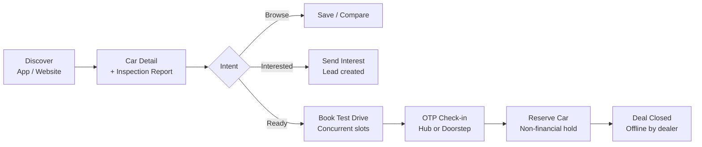
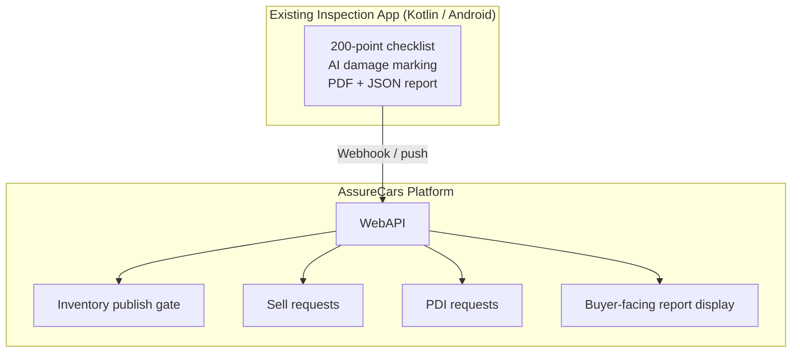
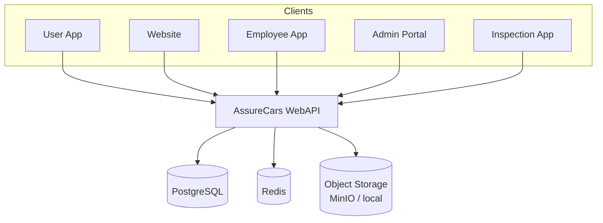

# AssureCars

**Premium Certified Used-Car Reseller Platform**

> **Interactive Prototype — [Open live preview ↗](https://assurecars-prototype.netlify.app)**
>
> Hosted on [Netlify](https://www.netlify.com/) (free, works with **private** repos). Updates to `prototype/` auto-deploy on every push to `main` (~1 min).

AssureCars is an enabling-technology product that lets **small-to-medium (SMB) car dealers** run their pre-owned car business online. Each dealer gets their own **self-hosted, single-tenant** deployment — their own website, mobile apps, catalog, leads, and test-drive operations — inspired by the customer experience of [Cars24](https://www.cars24.com/) and [Spinny](https://www.spinny.com/), but operated **by the dealer, for the dealer**.

> **Not a marketplace.** AssureCars does not own inventory or share data across dealers. One isolated instance per dealer: own database, storage, domain, and branding.

---

## Table of Contents

1. [Product at a Glance](#product-at-a-glance)
2. [Business Model](#business-model)
3. [Platform Surfaces](#platform-surfaces)
4. [Key Capabilities](#key-capabilities)
5. [Personas & Authentication](#personas--authentication)
6. [Architecture](#architecture)
7. [Technology Stack](#technology-stack)
8. [Interactive UI Prototype](#interactive-ui-prototype)
9. [Repository Structure](#repository-structure)
10. [Documentation](#documentation)
11. [Delivery Roadmap](#delivery-roadmap)

---

## Product at a Glance

| Aspect | Detail |
|--------|--------|
| **What it is** | Self-hosted dealer platform for certified pre-owned car sales |
| **Who buys it** | SMB car dealers / vendors (B2B product license) |
| **Who uses it** | Buyers (app/web), dealer staff (employee app), admins (portal) |
| **Trust anchor** | Mandatory 200-point inspection report (PDF) for every listed car |
| **Flagship feature** | **Concurrent-slot test-drive booking** — multiple buyers can book back-to-back drives in the same time window |
| **MVP scope** | Non-financial — no online payments, deposits, or financing; deals close offline |
| **Inspiration** | Cars24, Spinny — premium certified resale experience |

### End-to-End Buyer Journey



### Inspection Ecosystem

AssureCars **integrates with an existing Vehicle Inspection Mobile App** (see [`Vehicle-Inspection-Kotlin-Product/`](Vehicle-Inspection-Kotlin-Product/)) rather than rebuilding inspection capture. The inspection app is the system of record; AssureCars ingests structured JSON + PDF reports.



---

## Business Model

- **Product vendor model:** AssureCars licenses the platform to dealers; each dealer self-hosts one instance.
- **Unique inventory:** Every car is a specific VIN — sellable once, not a generic SKU.
- **Three listing sources:**
  - **Owned** — dealer's own stock
  - **Consigned · Vendor** — another vendor's car on commission
  - **Consigned · Individual** — individual owner's car on commission
- **Commission tracking is out of scope** — consignor contact is recorded; settlement stays offline.
- **Inspection PDF is mandatory** for all sourcing types before a car goes Live.
- **MVP is non-financial** — reservations are optimistic holds with TTL; payments/financing deferred to a future phase.

---

## Platform Surfaces

The interactive prototype models all four client surfaces plus the external inspection app integration.

| Surface | Platform | Users | Auth |
|---------|----------|-------|------|
| **User Mobile App** | Android + iOS (Flutter) | Buyers / sellers | OTP (User Login) |
| **Customer Website** | Web — Next.js SSR | Guests + buyers | OTP for authenticated flows |
| **Admin Panel** | Web SPA (React) | Catalog admins, hub managers, support | Password + MFA (Admin Login) |
| **Employee App** | Android + iOS (Flutter) | Sales executives, test-drive agents | Password (Employee Login) |
| **WebAPI** | ASP.NET Core (modular monolith) | All clients | JWT scoped by `accountType` + `allowedClients` |
| **Inspection App** *(external)* | Android (Kotlin) | Inspection technicians | Employee or Admin Login token |



---

## Key Capabilities

### MVP (Phase 1)

| Module | Description |
|--------|-------------|
| Identity & Auth | Three login types with client-scoped JWTs |
| Car Catalog & Inventory | Unique-VIN inventory, publish/delist, three listing sources |
| Search & Discovery | Faceted search, filters, sort |
| Vehicle Detail & Inspection Report | Ingested PDF + grade/score display |
| Interest / Lead Management | "Send Interest" → CRM funnel |
| **Test Drive Booking** | **Concurrent-slot engine** — configurable capacity per slot |
| Employee Operations | Lead management, conduct drives, OTP check-in |
| Inspection App Integration | Webhook ingestion of PDF + structured JSON |
| Notifications | Push, SMS, email |
| Admin & Configuration | Hubs, slot capacity, RBAC, branding |
| Reservation / Deal Handoff | Non-financial hold with TTL; single-winner per car |
| Reporting & Analytics | Basic ops dashboards |

### Phase 2

| Module | Description |
|--------|-------------|
| Reviews & Ratings | Post test-drive / deal feedback |
| Inspection Services | **Sell request** + **PDI request** (user-initiated) |
| Recommendations | Similar cars, price-drop alerts |
| WhatsApp channel | Notification channel |
| Promotions / Coupons | Marketing campaigns |

### Explicitly Out of Scope (MVP)

- Online payments, deposits, EMI/financing, refunds
- Commission tracking and settlement
- Multi-tenant SaaS (single-tenant self-host instead)
- C2C private listings / auctions

---

## Personas & Authentication

| Login Type | Auth Method | Client Apps Granted |
|------------|-------------|---------------------|
| **User Login** | OTP (phone/email) | User App, Website |
| **Employee Login** | Password (+ optional MFA) | Employee App, Inspection App |
| **Admin Login** | Password + MFA (required) | Admin Portal, Employee App, Inspection App |

| Persona | Surface | Key Actions |
|---------|---------|-------------|
| Guest | Web, User App | Browse & search without login |
| Registered User | Web, User App | Interest, test drives, reservations, Sell/PDI requests |
| Sales Executive | Employee App | Manage leads, conduct test drives, close deals |
| Test Drive Agent | Employee App | Doorstep drives, OTP verify, capture start/end |
| Inspection Technician | Inspection App | Perform inspection, generate PDF |
| Hub Manager | Employee App, Admin Portal | Hub inventory, staff, slot capacity |
| Catalog Admin | Admin Portal | Listings, pricing, certification |
| Super Admin | Admin Portal | RBAC, configuration, global settings |

---

## Architecture

### Deployment Model

- **Self-hosted, single-tenant per dealer** — one Docker Compose stack per instance
- Own PostgreSQL database, Redis, object storage (MinIO or local), reverse proxy (Caddy/NGINX)
- Dealer supplies domain, branding, and notification provider keys

### Inventory Uniqueness Principle

| Action | Rule | Mechanism |
|--------|------|-----------|
| **Reserve a car** | One winner at a time | Optimistic concurrency + hold TTL |
| **Sell a car** | One sale per VIN | Status transition to `Sold` |
| **Test drive a car** | Many allowed, capped by slot capacity | Redis counter + DB conditional update |

### Flagship: Concurrent-Slot Test-Drive Engine

Traditional booking uses one booking per slot. AssureCars subdivides time windows into short drives (e.g., 20 min) with configurable **capacity per slot** — the same car can serve multiple buyers back-to-back.

```
60-min window ÷ 20-min drives = 3 concurrent bookings on the same car
Capacity = min(car availability, hub bays, available agents)
```

---

## Technology Stack

| Layer | Choice |
|-------|--------|
| User + Employee Mobile | **Flutter** (or React Native) |
| Website | **Next.js** (React, TypeScript, SSR/ISR) |
| Admin Panel | **React SPA** + MUI / Ant Design |
| Backend | **ASP.NET Core Web API** (modular monolith) |
| Database | **PostgreSQL 15+** (FTS for search in MVP) |
| Cache / Locks | **Redis** |
| Object Storage | **MinIO** / local filesystem (S3-compatible) |
| Auth | OIDC + JWT (Keycloak or built-in) |
| Packaging | **Docker Compose** (one-command self-host) |
| CI/CD | GitHub Actions |

---

## Interactive UI Prototype

The repository includes a **fully interactive HTML prototype** in [`prototype/`](prototype/). It models all four client surfaces and is the fastest way to explore flows, screen layouts, and the product vocabulary before any production code is written.

### Open the Prototype

| Method | Link / command |
|--------|----------------|
| **Live preview** *(recommended — works with private repo)* | **[assurecars-prototype.netlify.app](https://assurecars-prototype.netlify.app)** |
| **Local** *(after clone)* | `open prototype/index.html` |
| **Local server** | `python3 -m http.server 8765 --directory prototype` → `http://localhost:8765/` |

Anyone with the README link can open the live preview — no GitHub access required. The **repo stays private**; only the static prototype is published.

### Auto-deploy on every push

Changes under `prototype/` are deployed automatically when you push to `main` (typically within **30–60 seconds**). No manual publish step.

**One-time setup** *(repo owner, ~5 minutes)*:

1. Create a free account at [netlify.com](https://www.netlify.com/).
2. **Add new site → Import an existing project → GitHub** → authorize Netlify for your private `AssureCars` repo.
3. Build settings are read from [`netlify.toml`](netlify.toml) automatically:
   - **Publish directory:** `prototype`
   - **Build command:** *(none)*
4. Deploy. Pick a site name (e.g. `assurecars-prototype`) — your URL becomes `https://assurecars-prototype.netlify.app`.
5. Update the live-preview URL at the top of this README if your site name differs.

After that, every `git push` that touches `prototype/` triggers a new deploy.

> **Alternatives** (same idea, free tier, private-repo support): [Vercel](https://vercel.com), [Cloudflare Pages](https://pages.cloudflare.com). Use publish directory `prototype`, no build command.

### Prototype Files

| File | Purpose |
|------|---------|
| [`prototype/index.html`](prototype/index.html) | Shell — top bar, surface tabs, stage canvas |
| [`prototype/styles.css`](prototype/styles.css) | Design tokens, layout, component styles |
| [`prototype/app.js`](prototype/app.js) | All screens, navigation, mock data, interactions |

### How to Navigate

1. Open the prototype in a browser.
2. Use the **top surface tabs** to switch between client applications:
   - **User App** — buyer mobile experience (phone frame)
   - **Website** — dealer storefront (desktop browser frame)
   - **Admin Panel** — dealer self-service portal (desktop)
   - **Employee App** — field operations (phone frame)
3. Click buttons, cards, and links inside each surface — every `data-go` element navigates to another screen.
4. Watch the **flow hint** in the top-right corner; it updates per surface to highlight the flagship flow.

### Prototype Screens by Surface

#### User App (28 screens)

| Area | Screens |
|------|---------|
| **Discovery** | Home, Search, Filters, Car Detail |
| **Auth** | Login (OTP), OTP Verification |
| **Engagement** | Send Interest, Interest Success, EMI Calculator |
| **Test Drives** | Book Test Drive, Booking Success, My Drives, Drive Detail, Reschedule |
| **Reservations** | Reserve Success, My Reservations |
| **Inspection Services** | Services Hub, Sell Request, PDI Request, Request Tracker |
| **Account** | Account, Profile, Settings, Saved Cars, Notifications |

**Recommended flow:** Home → Search → Car Detail → Book Test Drive → Confirm → Booking Success (note concurrent slot capacity labels).

#### Customer Website (9 screens)

| Screen | Purpose |
|--------|---------|
| Home | Hero, featured cars, trust messaging |
| Listing | Faceted browse with filters sidebar |
| Car Detail | Full specs, inspection report, CTAs |
| Book Test Drive | Slot picker with concurrent capacity |
| Sell Car | Instant quote form + inspection timeline |
| PDI Service | Pre-delivery inspection landing + FAQs |
| Certified Program | 200-checkpoint breakdown |
| Sign In | OTP authentication |

**Recommended flow:** Home → Listing → Car Detail → scroll to Inspection Report card.

#### Admin Panel (14 screens)

| Screen | Purpose |
|--------|---------|
| Dashboard | KPIs, demand funnel, ops board |
| Cars & Catalog | Inventory table with source + inspection status |
| Add / Edit Car | Publish gate (VIN, report, price, photos) |
| Consignors | Vendor / individual contact records |
| Inspections | Ingested reports, unmatched queue |
| Leads / CRM | Kanban board with lead scoring |
| Lead Detail | Activity timeline, disposition |
| Test-Drive Config | Slot template, duration, capacity, doorstep toggle |
| Reservations | Active holds, mark sold / release |
| Hubs & Staff | Hub bays, staff on shift |
| Reports & Analytics | TD metrics, hub breakdown, staff conversion |
| Users & RBAC | Staff accounts, role permissions matrix |
| Branding | Dealer name, colors, domain, provider keys |
| Feature Flags | Phase-gated module toggles |

**Recommended flow:** Dashboard → Test-Drive Config → adjust capacity stepper and watch the live preview.

#### Employee App (10 screens)

| Screen | Purpose |
|--------|---------|
| Login | Staff email + password |
| Schedule | Today's drives timeline |
| Conduct Test Drive | OTP check-in, odometer log |
| Drive Complete | Interest level, next action, notes |
| Doorstep En Route | Map mock, ETA, navigate |
| My Leads | Priority-sorted lead list |
| Lead Detail | Timeline, status update, reserve CTA |
| Hub Inventory | Per-car TD availability + capacity |
| Reservations | Mark sold / release holds |
| Profile | Stats, availability toggle |

**Recommended flow:** Schedule → Conduct Test Drive → OTP verify → Drive Complete.

### Design Language

The prototype uses a consistent token-based design system:

- **Primary:** Teal (`#0FB5A6`) — trust, certification
- **Accent:** Navy (`#0A1628`) — premium, authority
- **Typography:** Inter (Google Fonts)
- **Components:** Chips, score rings, OTP boxes, slot grids, kanban boards, KPI cards

---

## Repository Structure

```
AssureCars/
├── README.md                          ← You are here
├── prototype/                         ← Interactive UI prototype (HTML/CSS/JS)
│   ├── index.html
│   ├── styles.css
│   └── app.js
├── Docs/
│   ├── Solution-Design-Document.md    ← Full HLD + LLD (v1.7)
│   └── API-Documentation.md           ← REST API reference (v1)
├── database/
│   └── migrations/
│       └── 001_initial_schema.sql     ← PostgreSQL DDL baseline
├── Vehicle-Inspection-Kotlin-Product/ ← Existing inspection app (Kotlin / Android)
│   ├── README.md
│   ├── app/
│   ├── core/
│   └── specs/
├── .specify/                          ← Spec Kit tooling & templates
├── .cursor/                           ← Cursor skills & rules
└── .github/                           ← GitHub agents & prompts
```

---

## Documentation

| Document | Description |
|----------|-------------|
| [Solution Design Document](Docs/Solution-Design-Document.md) | Complete HLD + LLD — architecture, data model, module workflows, security, deployment |
| [API Documentation](Docs/API-Documentation.md) | REST API v1 — auth, endpoints, schemas, error codes |
| [Vehicle Inspection App README](Vehicle-Inspection-Kotlin-Product/README.md) | Existing Kotlin inspection app — features, setup, PDF generation |
| [Database Schema](database/migrations/001_initial_schema.sql) | PostgreSQL initial migration — enums, tables, indexes |

---

## Delivery Roadmap

Requirements are scoped **through Phase 2 only**. Everything in scope is **non-financial**.

| Phase | Theme | Key Deliverables |
|-------|-------|------------------|
| **MVP-a — Get Online** | Foundation | Self-host packaging, auth, catalog, search, car detail, inspection PDF ingestion, website + user app browse, admin config |
| **MVP-b — Capture Demand** | Core value | Interest/leads, **concurrent-slot test-drive booking**, employee app, non-financial reservations, notifications, basic dashboards |
| **Phase 2 — Engage & Grow** | Trust + supply | Reviews, Sell + PDI inspection services, recommendations, WhatsApp, promotions, richer analytics |

### Key Design Decisions

| Decision | Rationale |
|----------|-----------|
| Self-hosted, single-tenant | Data isolation, dealer ownership, simple licensing |
| Non-financial MVP | Fastest path to value; dealers keep offline deal closing |
| Integrate existing Inspection App | Reuse proven checklist + PDF; ingest via webhook |
| Flutter for both mobile apps | One codebase, shared design system |
| PostgreSQL FTS (not Elasticsearch) | Lean self-host footprint for SMB catalogs |
| Redis + DB for slot concurrency | Fast, authoritative capacity enforcement |
| Feature flags | Gradual module rollout without code forks |

---

## Getting Started (Development)

This repository is currently in the **design & prototype phase**. Production application code for the AssureCars platform surfaces (Flutter apps, Next.js website, React admin, WebAPI) is planned per the Solution Design Document.

**What you can do today:**

1. **Explore the prototype** — [live preview](https://assurecars-prototype.netlify.app) or `open prototype/index.html` locally (see above)
2. **Read the design docs** — start with the [Executive Summary](Docs/Solution-Design-Document.md#2-executive-summary)
3. **Run the Inspection App** — see [`Vehicle-Inspection-Kotlin-Product/README.md`](Vehicle-Inspection-Kotlin-Product/README.md)
4. **Review the database schema** — [`database/migrations/001_initial_schema.sql`](database/migrations/001_initial_schema.sql)

---

## License

Proprietary — internal project.
